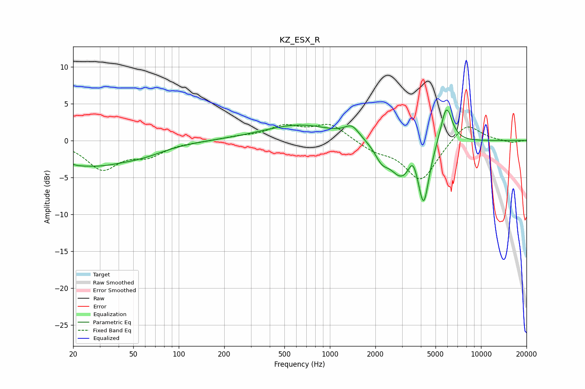

# KZ_ESX_R
See [usage instructions](https://github.com/jaakkopasanen/AutoEq#usage) for more options and info.

### Parametric EQs
Apply preamp of -4.2 dB when using parametric equalizer.

|   # | Type    |   Fc (Hz) |    Q |   Gain (dB) |
|-----|---------|-----------|------|-------------|
|   1 | Peaking |        20 | 2.14 |        -0.7 |
|   2 | Peaking |        28 | 0.69 |        -2.9 |
|   3 | Peaking |        58 | 0.89 |        -1.1 |
|   4 | Peaking |       632 | 0.59 |         2.1 |
|   5 | Peaking |      1399 | 2.94 |         1.6 |
|   6 | Peaking |      2201 | 3.25 |        -1.7 |
|   7 | Peaking |      2975 | 1.76 |        -4.6 |
|   8 | Peaking |      3544 | 4.86 |         2.1 |
|   9 | Peaking |      4176 | 3.93 |        -7.7 |
|  10 | Peaking |      5897 | 3.58 |         5.4 |

### Fixed Band EQs
When using fixed band (also called graphic) equalizer, apply preamp of **-2.3 dB** (if available) and set gains manually with these parameters.

|   # | Type    |   Fc (Hz) |    Q |   Gain (dB) |
|-----|---------|-----------|------|-------------|
|   1 | Peaking |        31 | 1.41 |        -3.7 |
|   2 | Peaking |        62 | 1.41 |        -1.8 |
|   3 | Peaking |       125 | 1.41 |        -0.1 |
|   4 | Peaking |       250 | 1.41 |         0.4 |
|   5 | Peaking |       500 | 1.41 |         1.8 |
|   6 | Peaking |      1000 | 1.41 |         2.2 |
|   7 | Peaking |      2000 | 1.41 |        -1.2 |
|   8 | Peaking |      4000 | 1.41 |        -5.4 |
|   9 | Peaking |      8000 | 1.41 |         2.6 |
|  10 | Peaking |     16000 | 1.41 |        -0.3 |

### Graphs

