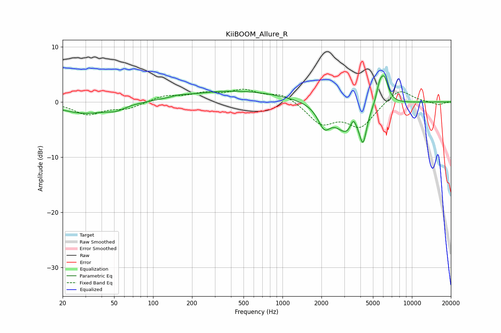

# KiiBOOM_Allure_R
See [usage instructions](https://github.com/jaakkopasanen/AutoEq#usage) for more options and info.

### Parametric EQs
Apply preamp of -4.8 dB when using parametric equalizer.

|   # | Type    |   Fc (Hz) |    Q |   Gain (dB) |
|-----|---------|-----------|------|-------------|
|   1 | Peaking |        30 | 0.73 |        -2.1 |
|   2 | Peaking |        52 | 2.27 |        -0.7 |
|   3 | Peaking |       158 | 2.44 |         0.3 |
|   4 | Peaking |       424 | 0.38 |         2   |
|   5 | Peaking |      2101 | 2.88 |        -3.7 |
|   6 | Peaking |      3163 | 1.62 |        -5.3 |
|   7 | Peaking |      3524 | 6    |         2.2 |
|   8 | Peaking |      4195 | 5.17 |        -5.4 |
|   9 | Peaking |      5622 | 5.85 |         2.4 |
|  10 | Peaking |      6105 | 4.18 |         4.5 |

### Fixed Band EQs
When using fixed band (also called graphic) equalizer, apply preamp of **-2.4 dB** (if available) and set gains manually with these parameters.

|   # | Type    |   Fc (Hz) |    Q |   Gain (dB) |
|-----|---------|-----------|------|-------------|
|   1 | Peaking |        31 | 1.41 |        -2.2 |
|   2 | Peaking |        62 | 1.41 |        -1.1 |
|   3 | Peaking |       125 | 1.41 |         1.1 |
|   4 | Peaking |       250 | 1.41 |         1.3 |
|   5 | Peaking |       500 | 1.41 |         1.9 |
|   6 | Peaking |      1000 | 1.41 |         1.5 |
|   7 | Peaking |      2000 | 1.41 |        -3.8 |
|   8 | Peaking |      4000 | 1.41 |        -4.4 |
|   9 | Peaking |      8000 | 1.41 |         2.6 |
|  10 | Peaking |     16000 | 1.41 |        -0.6 |

### Graphs

