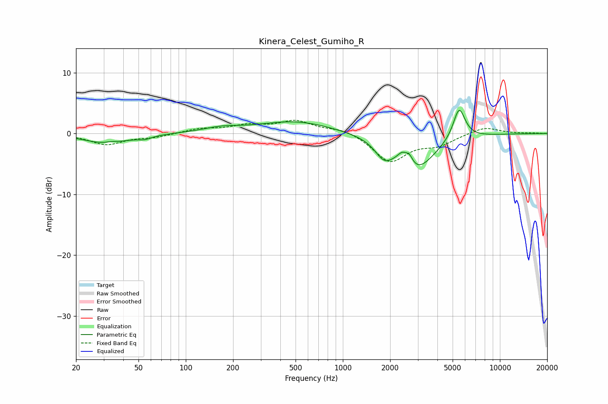

# Kinera_Celest_Gumiho_R
See [usage instructions](https://github.com/jaakkopasanen/AutoEq#usage) for more options and info.

### Parametric EQs
Apply preamp of -3.9 dB when using parametric equalizer.

|   # | Type    |   Fc (Hz) |    Q |   Gain (dB) |
|-----|---------|-----------|------|-------------|
|   1 | Peaking |        31 | 1.03 |        -1.6 |
|   2 | Peaking |        33 | 3.64 |         0.3 |
|   3 | Peaking |        55 | 3.2  |        -0.5 |
|   4 | Peaking |       169 | 1.21 |         0.7 |
|   5 | Peaking |       498 | 0.61 |         2   |
|   6 | Peaking |      1827 | 2.53 |        -2.6 |
|   7 | Peaking |      2394 | 4.49 |         1.6 |
|   8 | Peaking |      2653 | 6    |         1.5 |
|   9 | Peaking |      2915 | 1.19 |        -5.9 |
|  10 | Peaking |      5498 | 3.61 |         5.3 |

### Fixed Band EQs
When using fixed band (also called graphic) equalizer, apply preamp of **-2.3 dB** (if available) and set gains manually with these parameters.

|   # | Type    |   Fc (Hz) |    Q |   Gain (dB) |
|-----|---------|-----------|------|-------------|
|   1 | Peaking |        31 | 1.41 |        -1.8 |
|   2 | Peaking |        62 | 1.41 |        -0.5 |
|   3 | Peaking |       125 | 1.41 |         0.7 |
|   4 | Peaking |       250 | 1.41 |         1.2 |
|   5 | Peaking |       500 | 1.41 |         1.9 |
|   6 | Peaking |      1000 | 1.41 |         0.9 |
|   7 | Peaking |      2000 | 1.41 |        -4.6 |
|   8 | Peaking |      4000 | 1.41 |        -1.7 |
|   9 | Peaking |      8000 | 1.41 |         1.2 |
|  10 | Peaking |     16000 | 1.41 |         0.1 |

### Graphs

