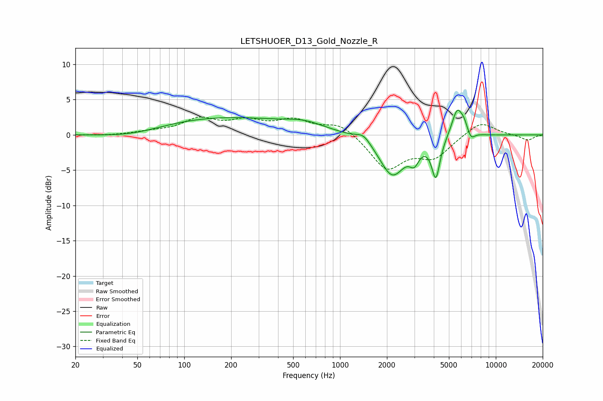

# LETSHUOER_D13_Gold_Nozzle_R
See [usage instructions](https://github.com/jaakkopasanen/AutoEq#usage) for more options and info.

### Parametric EQs
Apply preamp of -3.6 dB when using parametric equalizer.

|   # | Type    |   Fc (Hz) |    Q |   Gain (dB) |
|-----|---------|-----------|------|-------------|
|   1 | Peaking |        47 | 0.69 |        -1   |
|   2 | Peaking |       166 | 0.3  |         2.5 |
|   3 | Peaking |       594 | 1.15 |         0.9 |
|   4 | Peaking |      1414 | 3.23 |         1.1 |
|   5 | Peaking |      2165 | 1.72 |        -5.8 |
|   6 | Peaking |      3001 | 4.66 |        -2   |
|   7 | Peaking |      4122 | 5.25 |        -5.6 |
|   8 | Peaking |      5652 | 3.94 |         4   |
|   9 | Peaking |      6256 | 6    |         1.1 |
|  10 | Peaking |      6934 | 6    |        -1.1 |

### Fixed Band EQs
When using fixed band (also called graphic) equalizer, apply preamp of **-2.6 dB** (if available) and set gains manually with these parameters.

|   # | Type    |   Fc (Hz) |    Q |   Gain (dB) |
|-----|---------|-----------|------|-------------|
|   1 | Peaking |        31 | 1.41 |        -0.1 |
|   2 | Peaking |        62 | 1.41 |         0.4 |
|   3 | Peaking |       125 | 1.41 |         2.1 |
|   4 | Peaking |       250 | 1.41 |         1.7 |
|   5 | Peaking |       500 | 1.41 |         1.9 |
|   6 | Peaking |      1000 | 1.41 |         1.7 |
|   7 | Peaking |      2000 | 1.41 |        -4.8 |
|   8 | Peaking |      4000 | 1.41 |        -3   |
|   9 | Peaking |      8000 | 1.41 |         2   |
|  10 | Peaking |     16000 | 1.41 |        -0.8 |

### Graphs

