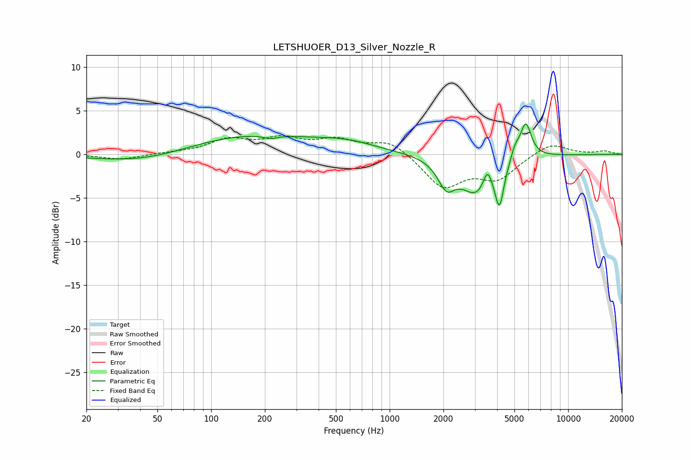

# LETSHUOER_D13_Silver_Nozzle_R
See [usage instructions](https://github.com/jaakkopasanen/AutoEq#usage) for more options and info.

### Parametric EQs
Apply preamp of -3.6 dB when using parametric equalizer.

|   # | Type    |   Fc (Hz) |    Q |   Gain (dB) |
|-----|---------|-----------|------|-------------|
|   1 | Peaking |        45 | 0.52 |        -1.4 |
|   2 | Peaking |       152 | 0.36 |         2.4 |
|   3 | Peaking |       216 | 3.63 |        -0.4 |
|   4 | Peaking |       587 | 0.87 |         0.9 |
|   5 | Peaking |      2079 | 2.95 |        -2.9 |
|   6 | Peaking |      3075 | 1.59 |        -4.3 |
|   7 | Peaking |      3529 | 6    |         2.1 |
|   8 | Peaking |      4122 | 5.92 |        -4.5 |
|   9 | Peaking |      5045 | 5.98 |         1.3 |
|  10 | Peaking |      5788 | 4.43 |         4.1 |

### Fixed Band EQs
When using fixed band (also called graphic) equalizer, apply preamp of **-2.3 dB** (if available) and set gains manually with these parameters.

|   # | Type    |   Fc (Hz) |    Q |   Gain (dB) |
|-----|---------|-----------|------|-------------|
|   1 | Peaking |        31 | 1.41 |        -0.6 |
|   2 | Peaking |        62 | 1.41 |         0.1 |
|   3 | Peaking |       125 | 1.41 |         1.6 |
|   4 | Peaking |       250 | 1.41 |         1.6 |
|   5 | Peaking |       500 | 1.41 |         1.5 |
|   6 | Peaking |      1000 | 1.41 |         1.6 |
|   7 | Peaking |      2000 | 1.41 |        -3.7 |
|   8 | Peaking |      4000 | 1.41 |        -2.6 |
|   9 | Peaking |      8000 | 1.41 |         1.4 |
|  10 | Peaking |     16000 | 1.41 |         0.4 |

### Graphs

