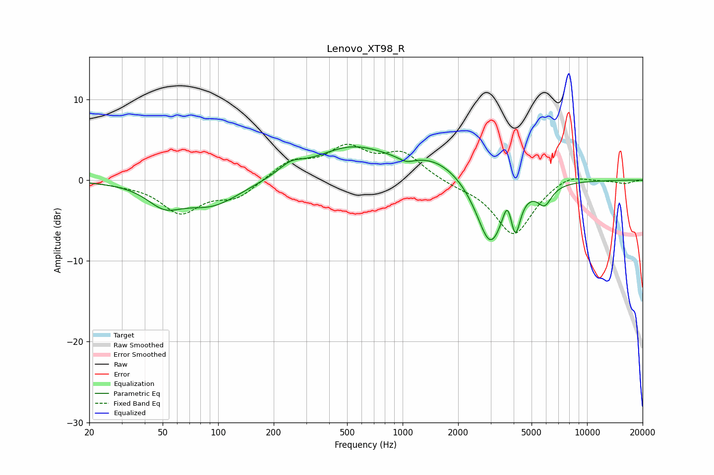

# Lenovo_XT98_R
See [usage instructions](https://github.com/jaakkopasanen/AutoEq#usage) for more options and info.

### Parametric EQs
Apply preamp of -4.2 dB when using parametric equalizer.

|   # | Type    |   Fc (Hz) |    Q |   Gain (dB) |
|-----|---------|-----------|------|-------------|
|   1 | Peaking |        51 | 1.54 |        -2.4 |
|   2 | Peaking |        92 | 0.89 |        -3.1 |
|   3 | Peaking |       247 | 2.13 |         1.2 |
|   4 | Peaking |       529 | 0.69 |         3.9 |
|   5 | Peaking |      1049 | 3.27 |        -0.7 |
|   6 | Peaking |      1552 | 0.87 |         2.3 |
|   7 | Peaking |      2986 | 1.85 |        -8.5 |
|   8 | Peaking |      3696 | 5.91 |         2.5 |
|   9 | Peaking |      4090 | 5.49 |        -4.4 |
|  10 | Peaking |      5885 | 3.56 |        -2.3 |

### Fixed Band EQs
When using fixed band (also called graphic) equalizer, apply preamp of **-4.5 dB** (if available) and set gains manually with these parameters.

|   # | Type    |   Fc (Hz) |    Q |   Gain (dB) |
|-----|---------|-----------|------|-------------|
|   1 | Peaking |        31 | 1.41 |        -0.3 |
|   2 | Peaking |        62 | 1.41 |        -3.9 |
|   3 | Peaking |       125 | 1.41 |        -2.1 |
|   4 | Peaking |       250 | 1.41 |         2.2 |
|   5 | Peaking |       500 | 1.41 |         3.6 |
|   6 | Peaking |      1000 | 1.41 |         3.1 |
|   7 | Peaking |      2000 | 1.41 |        -0.5 |
|   8 | Peaking |      4000 | 1.41 |        -6.8 |
|   9 | Peaking |      8000 | 1.41 |         1   |
|  10 | Peaking |     16000 | 1.41 |        -0.4 |

### Graphs

