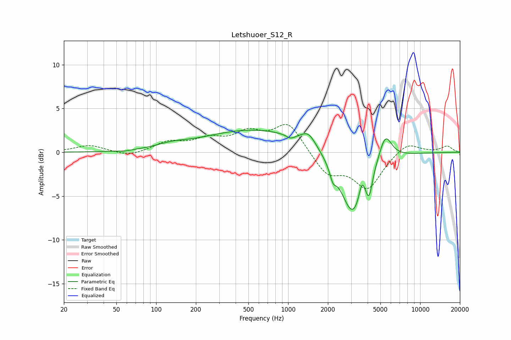

# Letshuoer_S12_R
See [usage instructions](https://github.com/jaakkopasanen/AutoEq#usage) for more options and info.

### Parametric EQs
Apply preamp of -2.6 dB when using parametric equalizer.

|   # | Type    |   Fc (Hz) |    Q |   Gain (dB) |
|-----|---------|-----------|------|-------------|
|   1 | Peaking |        57 | 2.93 |        -0.1 |
|   2 | Peaking |       131 | 1.25 |         0.5 |
|   3 | Peaking |       576 | 0.36 |         2.6 |
|   4 | Peaking |      1043 | 4.41 |        -0.4 |
|   5 | Peaking |      1426 | 2.52 |         1.5 |
|   6 | Peaking |      2184 | 5.98 |        -1.3 |
|   7 | Peaking |      3103 | 1.46 |        -7.6 |
|   8 | Peaking |      3619 | 6    |         2.1 |
|   9 | Peaking |      4105 | 6    |        -2.4 |
|  10 | Peaking |      5437 | 2.77 |         3.2 |

### Fixed Band EQs
When using fixed band (also called graphic) equalizer, apply preamp of **-3.3 dB** (if available) and set gains manually with these parameters.

|   # | Type    |   Fc (Hz) |    Q |   Gain (dB) |
|-----|---------|-----------|------|-------------|
|   1 | Peaking |        31 | 1.41 |         0.8 |
|   2 | Peaking |        62 | 1.41 |        -0.5 |
|   3 | Peaking |       125 | 1.41 |         1.1 |
|   4 | Peaking |       250 | 1.41 |         1.3 |
|   5 | Peaking |       500 | 1.41 |         2   |
|   6 | Peaking |      1000 | 1.41 |         3.3 |
|   7 | Peaking |      2000 | 1.41 |        -2.5 |
|   8 | Peaking |      4000 | 1.41 |        -4   |
|   9 | Peaking |      8000 | 1.41 |         1.3 |
|  10 | Peaking |     16000 | 1.41 |         0.7 |

### Graphs

