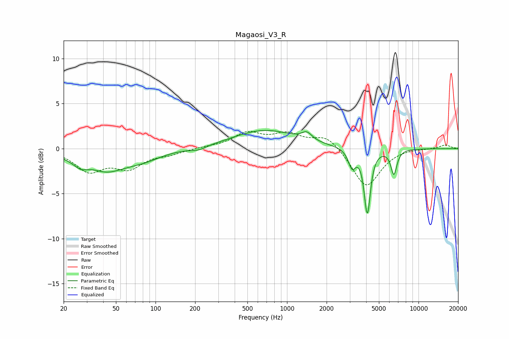

# Magaosi_V3_R
See [usage instructions](https://github.com/jaakkopasanen/AutoEq#usage) for more options and info.

### Parametric EQs
Apply preamp of -2.1 dB when using parametric equalizer.

|   # | Type    |   Fc (Hz) |    Q |   Gain (dB) |
|-----|---------|-----------|------|-------------|
|   1 | Peaking |        27 | 2.93 |        -0.6 |
|   2 | Peaking |        34 | 2.08 |         0.4 |
|   3 | Peaking |        39 | 0.84 |        -2.6 |
|   4 | Peaking |        82 | 1.05 |        -0.8 |
|   5 | Peaking |       212 | 2.26 |        -0.4 |
|   6 | Peaking |       678 | 0.59 |         2   |
|   7 | Peaking |      1414 | 3.62 |         0.9 |
|   8 | Peaking |      3123 | 5.08 |        -1.9 |
|   9 | Peaking |      4080 | 6    |        -7.1 |
|  10 | Peaking |      6495 | 6    |        -2.7 |

### Fixed Band EQs
When using fixed band (also called graphic) equalizer, apply preamp of **-2.0 dB** (if available) and set gains manually with these parameters.

|   # | Type    |   Fc (Hz) |    Q |   Gain (dB) |
|-----|---------|-----------|------|-------------|
|   1 | Peaking |        31 | 1.41 |        -2.4 |
|   2 | Peaking |        62 | 1.41 |        -1.9 |
|   3 | Peaking |       125 | 1.41 |        -0.5 |
|   4 | Peaking |       250 | 1.41 |         0.1 |
|   5 | Peaking |       500 | 1.41 |         1.6 |
|   6 | Peaking |      1000 | 1.41 |         1.4 |
|   7 | Peaking |      2000 | 1.41 |         1.5 |
|   8 | Peaking |      4000 | 1.41 |        -4.4 |
|   9 | Peaking |      8000 | 1.41 |         0.1 |
|  10 | Peaking |     16000 | 1.41 |         0.4 |

### Graphs

