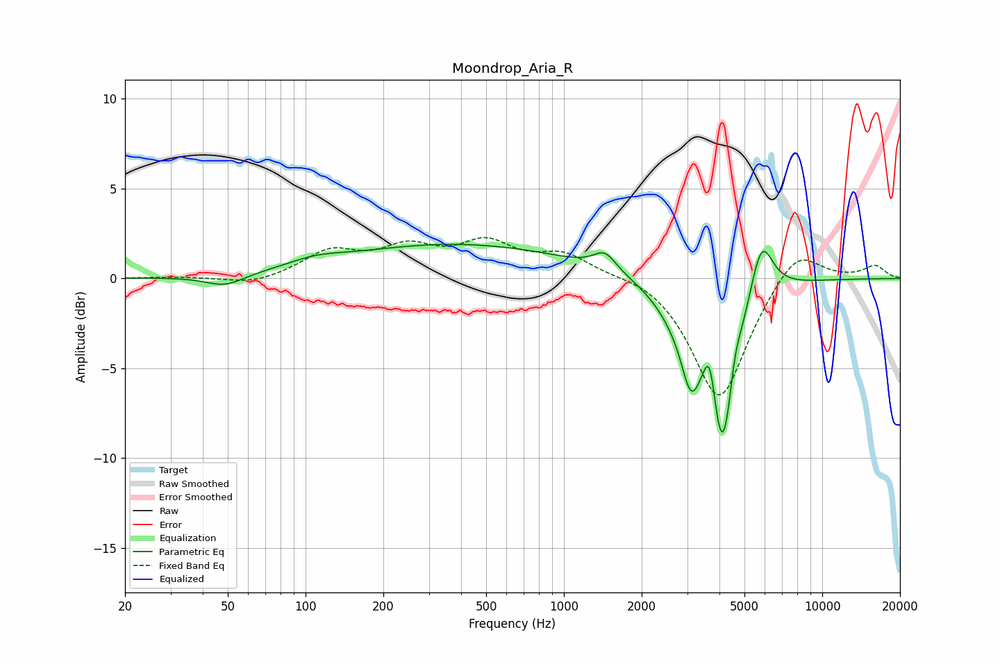

# Moondrop_Aria_R
See [usage instructions](https://github.com/jaakkopasanen/AutoEq#usage) for more options and info.

### Parametric EQs
Apply preamp of -2.0 dB when using parametric equalizer.

|   # | Type    |   Fc (Hz) |    Q |   Gain (dB) |
|-----|---------|-----------|------|-------------|
|   1 | Peaking |        49 | 1.9  |        -0.6 |
|   2 | Peaking |       109 | 1.31 |         0.4 |
|   3 | Peaking |       388 | 0.31 |         1.9 |
|   4 | Peaking |      1441 | 3.23 |         1   |
|   5 | Peaking |      2681 | 1.65 |        -1.2 |
|   6 | Peaking |      3103 | 3.76 |        -3.4 |
|   7 | Peaking |      3675 | 6    |         2.8 |
|   8 | Peaking |      4112 | 2.69 |        -9.8 |
|   9 | Peaking |      4576 | 5.99 |         1.6 |
|  10 | Peaking |      5810 | 3.08 |         3.4 |

### Fixed Band EQs
When using fixed band (also called graphic) equalizer, apply preamp of **-2.4 dB** (if available) and set gains manually with these parameters.

|   # | Type    |   Fc (Hz) |    Q |   Gain (dB) |
|-----|---------|-----------|------|-------------|
|   1 | Peaking |        31 | 1.41 |         0.1 |
|   2 | Peaking |        62 | 1.41 |        -0.4 |
|   3 | Peaking |       125 | 1.41 |         1.4 |
|   4 | Peaking |       250 | 1.41 |         1.5 |
|   5 | Peaking |       500 | 1.41 |         1.8 |
|   6 | Peaking |      1000 | 1.41 |         1.3 |
|   7 | Peaking |      2000 | 1.41 |         0.3 |
|   8 | Peaking |      4000 | 1.41 |        -6.9 |
|   9 | Peaking |      8000 | 1.41 |         1.9 |
|  10 | Peaking |     16000 | 1.41 |         0.7 |

### Graphs

