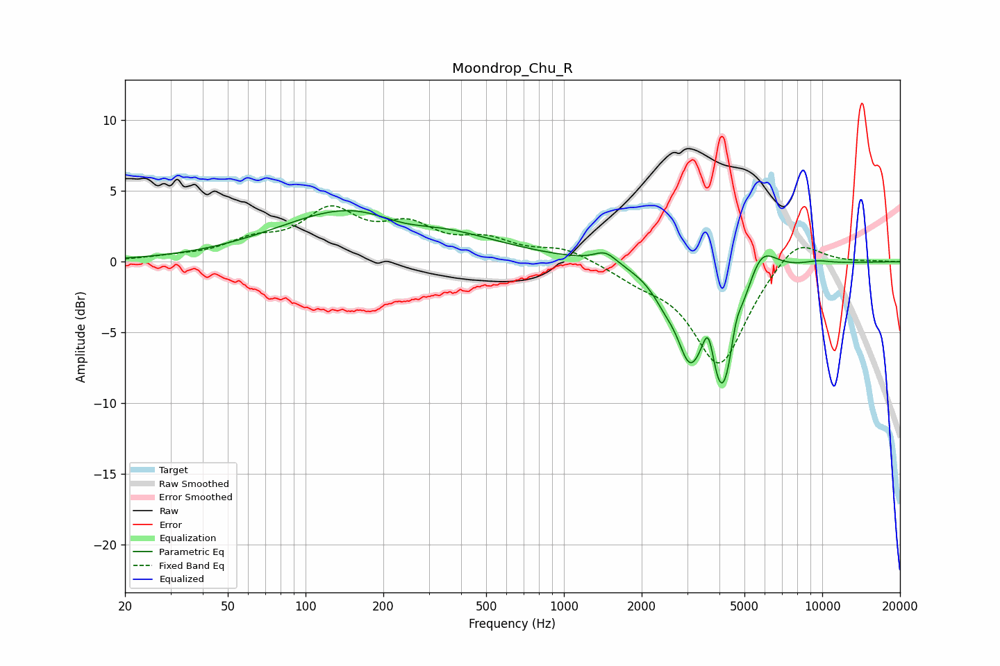

# Moondrop_Chu_R
See [usage instructions](https://github.com/jaakkopasanen/AutoEq#usage) for more options and info.

### Parametric EQs
Apply preamp of -3.7 dB when using parametric equalizer.

|   # | Type    |   Fc (Hz) |    Q |   Gain (dB) |
|-----|---------|-----------|------|-------------|
|   1 | Peaking |       182 | 0.45 |         4.5 |
|   2 | Peaking |       237 | 1.05 |        -1.4 |
|   3 | Peaking |      1448 | 3.22 |         0.9 |
|   4 | Peaking |      2457 | 2.87 |        -1.2 |
|   5 | Peaking |      3052 | 3.1  |        -4   |
|   6 | Peaking |      3628 | 5.99 |         3.1 |
|   7 | Peaking |      4113 | 2.15 |        -9.9 |
|   8 | Peaking |      4630 | 5.99 |         1.9 |
|   9 | Peaking |      5743 | 2.24 |         2.9 |
|  10 | Peaking |      9578 | 2.35 |         0.2 |

### Fixed Band EQs
When using fixed band (also called graphic) equalizer, apply preamp of **-4.0 dB** (if available) and set gains manually with these parameters.

|   # | Type    |   Fc (Hz) |    Q |   Gain (dB) |
|-----|---------|-----------|------|-------------|
|   1 | Peaking |        31 | 1.41 |         0.2 |
|   2 | Peaking |        62 | 1.41 |         1.2 |
|   3 | Peaking |       125 | 1.41 |         3.3 |
|   4 | Peaking |       250 | 1.41 |         2.1 |
|   5 | Peaking |       500 | 1.41 |         1.3 |
|   6 | Peaking |      1000 | 1.41 |         0.9 |
|   7 | Peaking |      2000 | 1.41 |        -0.9 |
|   8 | Peaking |      4000 | 1.41 |        -7.3 |
|   9 | Peaking |      8000 | 1.41 |         2   |
|  10 | Peaking |     16000 | 1.41 |         0.1 |

### Graphs

