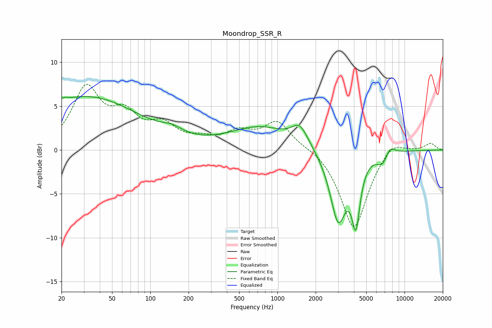

# Moondrop_SSR_R
See [usage instructions](https://github.com/jaakkopasanen/AutoEq#usage) for more options and info.

### Parametric EQs
Apply preamp of -6.2 dB when using parametric equalizer.

|   # | Type    |   Fc (Hz) |    Q |   Gain (dB) |
|-----|---------|-----------|------|-------------|
|   1 | Peaking |        21 | 5.68 |         0.3 |
|   2 | Peaking |        31 | 0.33 |         6.1 |
|   3 | Peaking |       148 | 1.67 |         0.8 |
|   4 | Peaking |       728 | 0.6  |         2.5 |
|   5 | Peaking |      1503 | 2.26 |         2.2 |
|   6 | Peaking |      3008 | 2.17 |        -8.1 |
|   7 | Peaking |      3991 | 5.99 |        -0.2 |
|   8 | Peaking |      4148 | 4.37 |        -6.5 |
|   9 | Peaking |      6714 | 3.13 |        -1.3 |
|  10 | Peaking |      7690 | 3.47 |         1   |

### Fixed Band EQs
When using fixed band (also called graphic) equalizer, apply preamp of **-7.6 dB** (if available) and set gains manually with these parameters.

|   # | Type    |   Fc (Hz) |    Q |   Gain (dB) |
|-----|---------|-----------|------|-------------|
|   1 | Peaking |        31 | 1.41 |         6.8 |
|   2 | Peaking |        62 | 1.41 |         3.4 |
|   3 | Peaking |       125 | 1.41 |         2.4 |
|   4 | Peaking |       250 | 1.41 |         0.9 |
|   5 | Peaking |       500 | 1.41 |         1.7 |
|   6 | Peaking |      1000 | 1.41 |         3.1 |
|   7 | Peaking |      2000 | 1.41 |         0.4 |
|   8 | Peaking |      4000 | 1.41 |        -9.1 |
|   9 | Peaking |      8000 | 1.41 |         1.4 |
|  10 | Peaking |     16000 | 1.41 |         0.8 |

### Graphs

