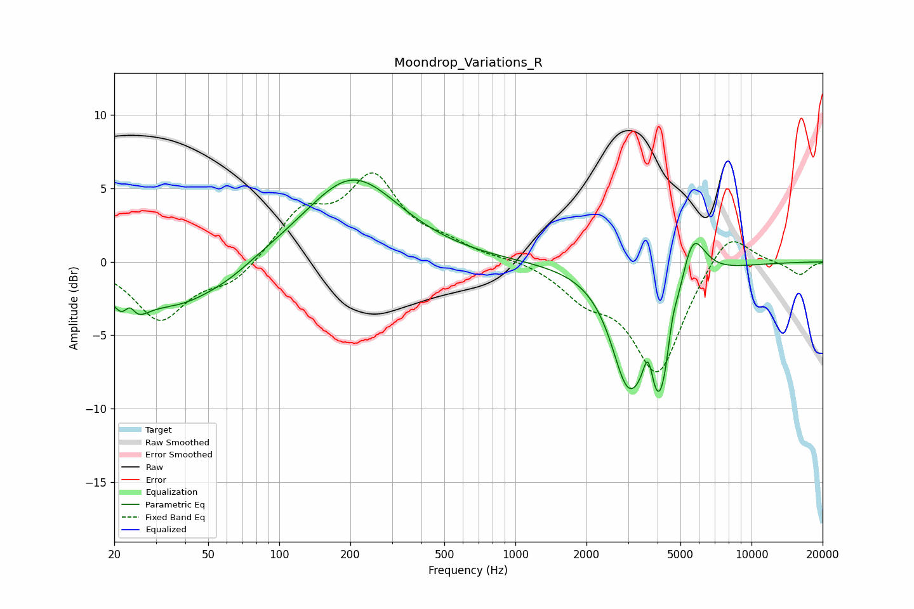

# Moondrop_Variations_R
See [usage instructions](https://github.com/jaakkopasanen/AutoEq#usage) for more options and info.

### Parametric EQs
Apply preamp of -5.7 dB when using parametric equalizer.

|   # | Type    |   Fc (Hz) |    Q |   Gain (dB) |
|-----|---------|-----------|------|-------------|
|   1 | Peaking |        23 | 2.51 |        -3.4 |
|   2 | Peaking |        23 | 5.4  |         1.8 |
|   3 | Peaking |        38 | 0.77 |        -2.8 |
|   4 | Peaking |        62 | 1.44 |        -0.4 |
|   5 | Peaking |       204 | 0.7  |         5.8 |
|   6 | Peaking |      2966 | 2.09 |        -5.6 |
|   7 | Peaking |      3649 | 5.99 |         3.2 |
|   8 | Peaking |      4086 | 1.93 |       -10   |
|   9 | Peaking |      4615 | 5.99 |         2.1 |
|  10 | Peaking |      5560 | 2.4  |         4.9 |

### Fixed Band EQs
When using fixed band (also called graphic) equalizer, apply preamp of **-6.2 dB** (if available) and set gains manually with these parameters.

|   # | Type    |   Fc (Hz) |    Q |   Gain (dB) |
|-----|---------|-----------|------|-------------|
|   1 | Peaking |        31 | 1.41 |        -3.9 |
|   2 | Peaking |        62 | 1.41 |        -1.4 |
|   3 | Peaking |       125 | 1.41 |         3.2 |
|   4 | Peaking |       250 | 1.41 |         5.4 |
|   5 | Peaking |       500 | 1.41 |         0.9 |
|   6 | Peaking |      1000 | 1.41 |         0.2 |
|   7 | Peaking |      2000 | 1.41 |        -2   |
|   8 | Peaking |      4000 | 1.41 |        -7.5 |
|   9 | Peaking |      8000 | 1.41 |         2.5 |
|  10 | Peaking |     16000 | 1.41 |        -0.9 |

### Graphs

