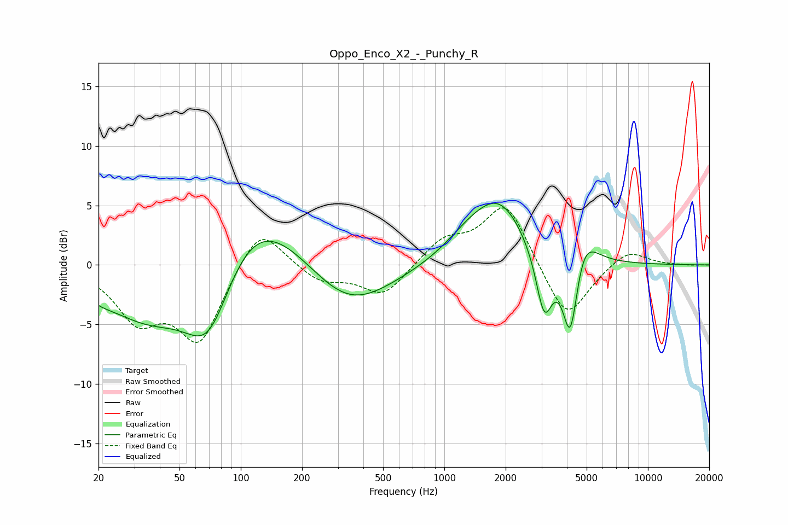

# Oppo_Enco_X2_-_Punchy_R
See [usage instructions](https://github.com/jaakkopasanen/AutoEq#usage) for more options and info.

### Parametric EQs
Apply preamp of -5.3 dB when using parametric equalizer.

|   # | Type    |   Fc (Hz) |    Q |   Gain (dB) |
|-----|---------|-----------|------|-------------|
|   1 | Peaking |        20 | 1.92 |        -0.6 |
|   2 | Peaking |        35 | 0.66 |        -4.6 |
|   3 | Peaking |        70 | 1.06 |        -8.6 |
|   4 | Peaking |       106 | 0.56 |         7.4 |
|   5 | Peaking |       335 | 0.67 |        -4.3 |
|   6 | Peaking |      1330 | 1.11 |         1.7 |
|   7 | Peaking |      1881 | 1.12 |         4.7 |
|   8 | Peaking |      3093 | 3.46 |        -5.4 |
|   9 | Peaking |      4161 | 3.67 |        -7.5 |
|  10 | Peaking |      4763 | 2.21 |         3.2 |

### Fixed Band EQs
When using fixed band (also called graphic) equalizer, apply preamp of **-4.9 dB** (if available) and set gains manually with these parameters.

|   # | Type    |   Fc (Hz) |    Q |   Gain (dB) |
|-----|---------|-----------|------|-------------|
|   1 | Peaking |        31 | 1.41 |        -4.2 |
|   2 | Peaking |        62 | 1.41 |        -6.3 |
|   3 | Peaking |       125 | 1.41 |         3.7 |
|   4 | Peaking |       250 | 1.41 |        -1.4 |
|   5 | Peaking |       500 | 1.41 |        -2.6 |
|   6 | Peaking |      1000 | 1.41 |         2   |
|   7 | Peaking |      2000 | 1.41 |         5.3 |
|   8 | Peaking |      4000 | 1.41 |        -4.9 |
|   9 | Peaking |      8000 | 1.41 |         1.4 |
|  10 | Peaking |     16000 | 1.41 |        -0   |

### Graphs

