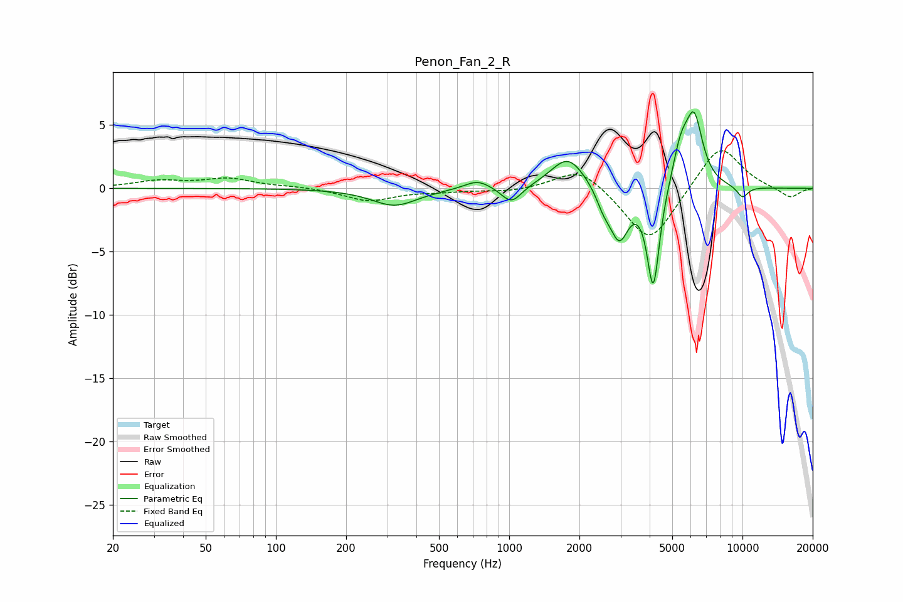

# Penon_Fan_2_R
See [usage instructions](https://github.com/jaakkopasanen/AutoEq#usage) for more options and info.

### Parametric EQs
Apply preamp of -6.2 dB when using parametric equalizer.

|   # | Type    |   Fc (Hz) |    Q |   Gain (dB) |
|-----|---------|-----------|------|-------------|
|   1 | Peaking |       322 | 1.45 |        -1.4 |
|   2 | Peaking |       732 | 2.49 |         0.7 |
|   3 | Peaking |      1022 | 3.23 |        -1.4 |
|   4 | Peaking |      1789 | 1.91 |         2.6 |
|   5 | Peaking |      2538 | 4.55 |        -1.2 |
|   6 | Peaking |      2963 | 3.48 |        -3.9 |
|   7 | Peaking |      4147 | 5.29 |        -8   |
|   8 | Peaking |      5438 | 3.85 |         3   |
|   9 | Peaking |      6212 | 3.78 |         5.2 |
|  10 | Peaking |     10000 | 5.04 |        -0.9 |

### Fixed Band EQs
When using fixed band (also called graphic) equalizer, apply preamp of **-3.1 dB** (if available) and set gains manually with these parameters.

|   # | Type    |   Fc (Hz) |    Q |   Gain (dB) |
|-----|---------|-----------|------|-------------|
|   1 | Peaking |        31 | 1.41 |         0.5 |
|   2 | Peaking |        62 | 1.41 |         0.7 |
|   3 | Peaking |       125 | 1.41 |         0.1 |
|   4 | Peaking |       250 | 1.41 |        -1   |
|   5 | Peaking |       500 | 1.41 |        -0.2 |
|   6 | Peaking |      1000 | 1.41 |        -0.3 |
|   7 | Peaking |      2000 | 1.41 |         1.8 |
|   8 | Peaking |      4000 | 1.41 |        -4.5 |
|   9 | Peaking |      8000 | 1.41 |         3.6 |
|  10 | Peaking |     16000 | 1.41 |        -0.8 |

### Graphs

