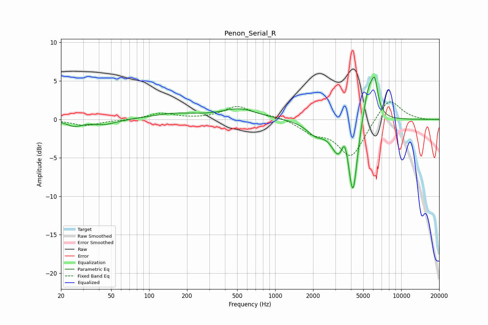

# Penon_Serial_R
See [usage instructions](https://github.com/jaakkopasanen/AutoEq#usage) for more options and info.

### Parametric EQs
Apply preamp of -5.6 dB when using parametric equalizer.

|   # | Type    |   Fc (Hz) |    Q |   Gain (dB) |
|-----|---------|-----------|------|-------------|
|   1 | Peaking |        26 | 2.27 |        -0.8 |
|   2 | Peaking |        44 | 1.4  |        -0.7 |
|   3 | Peaking |       162 | 0.76 |         0.7 |
|   4 | Peaking |       522 | 1.02 |         1.3 |
|   5 | Peaking |      2089 | 1.93 |        -1.6 |
|   6 | Peaking |      3194 | 2.39 |        -3.8 |
|   7 | Peaking |      3559 | 5.44 |         2.5 |
|   8 | Peaking |      4144 | 4.01 |        -9.2 |
|   9 | Peaking |      5531 | 3.01 |         4.9 |
|  10 | Peaking |      6173 | 5.86 |         3.3 |

### Fixed Band EQs
When using fixed band (also called graphic) equalizer, apply preamp of **-2.4 dB** (if available) and set gains manually with these parameters.

|   # | Type    |   Fc (Hz) |    Q |   Gain (dB) |
|-----|---------|-----------|------|-------------|
|   1 | Peaking |        31 | 1.41 |        -0.8 |
|   2 | Peaking |        62 | 1.41 |        -0.1 |
|   3 | Peaking |       125 | 1.41 |         0.8 |
|   4 | Peaking |       250 | 1.41 |         0   |
|   5 | Peaking |       500 | 1.41 |         1.6 |
|   6 | Peaking |      1000 | 1.41 |         0.4 |
|   7 | Peaking |      2000 | 1.41 |        -1.5 |
|   8 | Peaking |      4000 | 1.41 |        -4.9 |
|   9 | Peaking |      8000 | 1.41 |         3   |
|  10 | Peaking |     16000 | 1.41 |        -0.1 |

### Graphs

