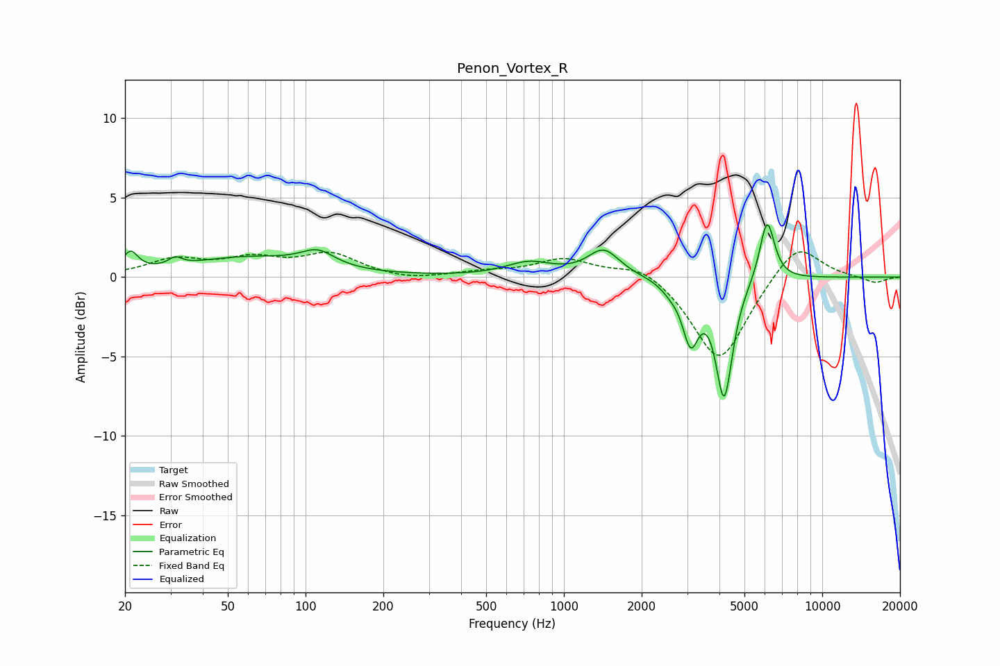

# Penon_Vortex_R
See [usage instructions](https://github.com/jaakkopasanen/AutoEq#usage) for more options and info.

### Parametric EQs
Apply preamp of -3.4 dB when using parametric equalizer.

|   # | Type    |   Fc (Hz) |    Q |   Gain (dB) |
|-----|---------|-----------|------|-------------|
|   1 | Peaking |        21 | 4.99 |         1.2 |
|   2 | Peaking |        31 | 5.68 |         0.5 |
|   3 | Peaking |        59 | 0.61 |         1.2 |
|   4 | Peaking |       111 | 2.16 |         1   |
|   5 | Peaking |       734 | 1.59 |         0.9 |
|   6 | Peaking |      1425 | 2.33 |         1.7 |
|   7 | Peaking |      2582 | 3.71 |        -0.4 |
|   8 | Peaking |      3094 | 4.5  |        -3.6 |
|   9 | Peaking |      4173 | 4.29 |        -7.4 |
|  10 | Peaking |      6117 | 4.8  |         3.9 |

### Fixed Band EQs
When using fixed band (also called graphic) equalizer, apply preamp of **-1.7 dB** (if available) and set gains manually with these parameters.

|   # | Type    |   Fc (Hz) |    Q |   Gain (dB) |
|-----|---------|-----------|------|-------------|
|   1 | Peaking |        31 | 1.41 |         1   |
|   2 | Peaking |        62 | 1.41 |         1   |
|   3 | Peaking |       125 | 1.41 |         1.4 |
|   4 | Peaking |       250 | 1.41 |        -0.3 |
|   5 | Peaking |       500 | 1.41 |         0.3 |
|   6 | Peaking |      1000 | 1.41 |         1.1 |
|   7 | Peaking |      2000 | 1.41 |         0.9 |
|   8 | Peaking |      4000 | 1.41 |        -5.5 |
|   9 | Peaking |      8000 | 1.41 |         2.3 |
|  10 | Peaking |     16000 | 1.41 |        -0.4 |

### Graphs

