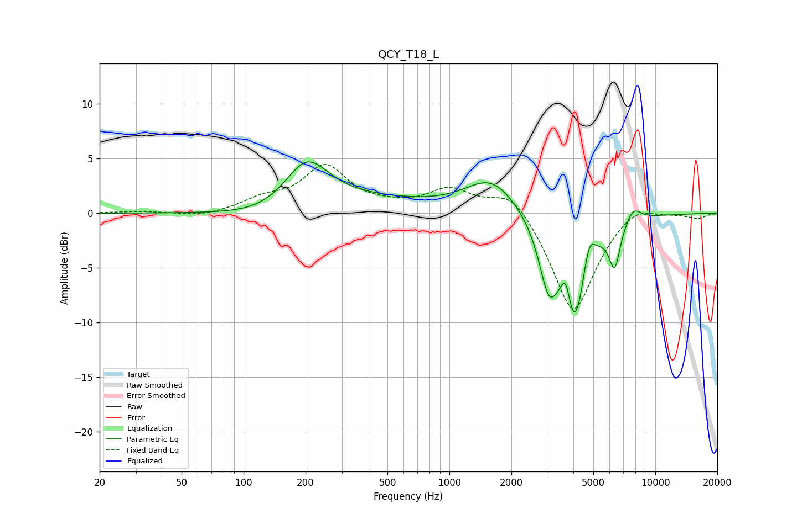

# QCY_T18_L
See [usage instructions](https://github.com/jaakkopasanen/AutoEq#usage) for more options and info.

### Parametric EQs
Apply preamp of -4.8 dB when using parametric equalizer.

|   # | Type    |   Fc (Hz) |    Q |   Gain (dB) |
|-----|---------|-----------|------|-------------|
|   1 | Peaking |       137 | 0.74 |        -1.1 |
|   2 | Peaking |       202 | 1.32 |         4.4 |
|   3 | Peaking |       338 | 0.41 |         1.2 |
|   4 | Peaking |      1600 | 1.14 |         3.1 |
|   5 | Peaking |      3031 | 3.02 |        -5.4 |
|   6 | Peaking |      3680 | 6    |         2.9 |
|   7 | Peaking |      4044 | 2.3  |       -10.2 |
|   8 | Peaking |      4754 | 4.72 |         3.1 |
|   9 | Peaking |      6347 | 5.07 |        -3.9 |
|  10 | Peaking |      7807 | 3.53 |         1.4 |

### Fixed Band EQs
When using fixed band (also called graphic) equalizer, apply preamp of **-4.6 dB** (if available) and set gains manually with these parameters.

|   # | Type    |   Fc (Hz) |    Q |   Gain (dB) |
|-----|---------|-----------|------|-------------|
|   1 | Peaking |        31 | 1.41 |         0.2 |
|   2 | Peaking |        62 | 1.41 |        -0.4 |
|   3 | Peaking |       125 | 1.41 |         1.1 |
|   4 | Peaking |       250 | 1.41 |         4.1 |
|   5 | Peaking |       500 | 1.41 |         0.4 |
|   6 | Peaking |      1000 | 1.41 |         2.1 |
|   7 | Peaking |      2000 | 1.41 |         2.3 |
|   8 | Peaking |      4000 | 1.41 |        -9.3 |
|   9 | Peaking |      8000 | 1.41 |         1.2 |
|  10 | Peaking |     16000 | 1.41 |        -0.4 |

### Graphs

