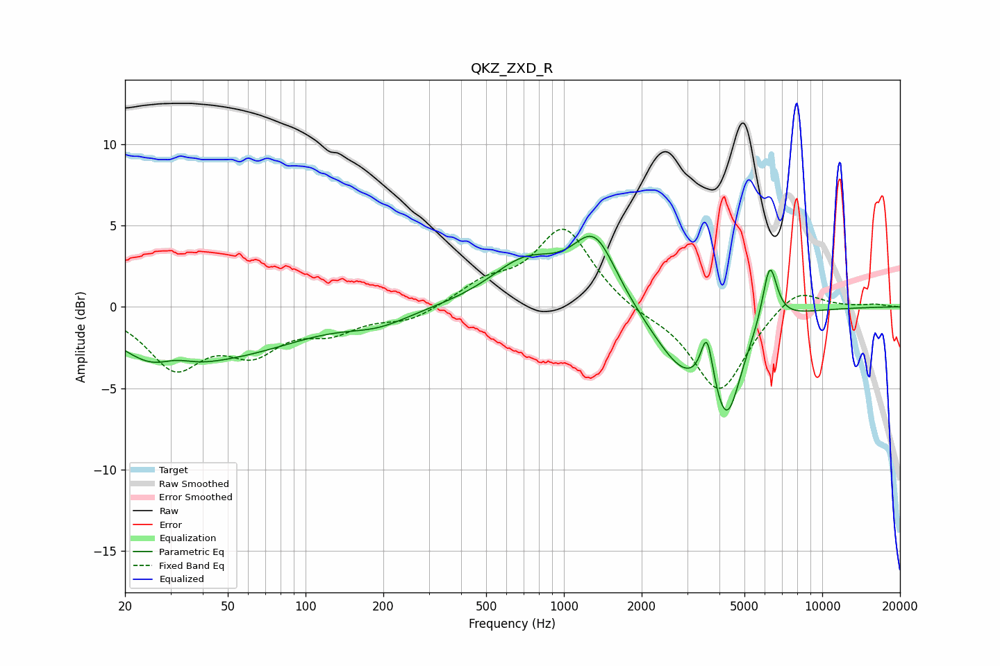

# QKZ_ZXD_R
See [usage instructions](https://github.com/jaakkopasanen/AutoEq#usage) for more options and info.

### Parametric EQs
Apply preamp of -4.4 dB when using parametric equalizer.

|   # | Type    |   Fc (Hz) |    Q |   Gain (dB) |
|-----|---------|-----------|------|-------------|
|   1 | Peaking |        28 | 0.9  |        -3.4 |
|   2 | Peaking |        31 | 1.81 |         1.2 |
|   3 | Peaking |        60 | 0.56 |        -2   |
|   4 | Peaking |       191 | 1.11 |        -0.8 |
|   5 | Peaking |       710 | 1.04 |         2.7 |
|   6 | Peaking |      1317 | 1.64 |         4.2 |
|   7 | Peaking |      2957 | 1.11 |        -3.8 |
|   8 | Peaking |      3580 | 5.94 |         3.2 |
|   9 | Peaking |      4274 | 2.59 |        -5.2 |
|  10 | Peaking |      6264 | 4.86 |         3.8 |

### Fixed Band EQs
When using fixed band (also called graphic) equalizer, apply preamp of **-4.9 dB** (if available) and set gains manually with these parameters.

|   # | Type    |   Fc (Hz) |    Q |   Gain (dB) |
|-----|---------|-----------|------|-------------|
|   1 | Peaking |        31 | 1.41 |        -3.5 |
|   2 | Peaking |        62 | 1.41 |        -2.4 |
|   3 | Peaking |       125 | 1.41 |        -1.3 |
|   4 | Peaking |       250 | 1.41 |        -0.8 |
|   5 | Peaking |       500 | 1.41 |         1.3 |
|   6 | Peaking |      1000 | 1.41 |         4.8 |
|   7 | Peaking |      2000 | 1.41 |        -0.4 |
|   8 | Peaking |      4000 | 1.41 |        -5.3 |
|   9 | Peaking |      8000 | 1.41 |         1.4 |
|  10 | Peaking |     16000 | 1.41 |         0.1 |

### Graphs

