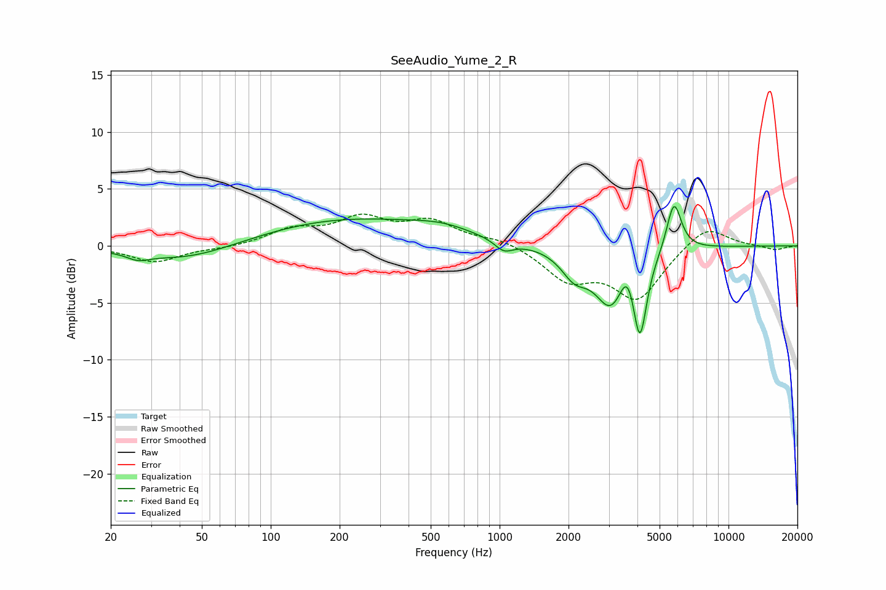

# SeeAudio_Yume_2_R
See [usage instructions](https://github.com/jaakkopasanen/AutoEq#usage) for more options and info.

### Parametric EQs
Apply preamp of -3.5 dB when using parametric equalizer.

|   # | Type    |   Fc (Hz) |    Q |   Gain (dB) |
|-----|---------|-----------|------|-------------|
|   1 | Peaking |        26 | 2.98 |        -0.5 |
|   2 | Peaking |        43 | 0.66 |        -1.4 |
|   3 | Peaking |       217 | 0.37 |         2.3 |
|   4 | Peaking |       564 | 1.08 |         0.7 |
|   5 | Peaking |      1045 | 3.54 |        -0.9 |
|   6 | Peaking |      2120 | 2.47 |        -2   |
|   7 | Peaking |      3070 | 1.99 |        -5   |
|   8 | Peaking |      3619 | 4.06 |         2.5 |
|   9 | Peaking |      4101 | 4.71 |        -7.1 |
|  10 | Peaking |      5777 | 4.31 |         4.5 |

### Fixed Band EQs
When using fixed band (also called graphic) equalizer, apply preamp of **-2.9 dB** (if available) and set gains manually with these parameters.

|   # | Type    |   Fc (Hz) |    Q |   Gain (dB) |
|-----|---------|-----------|------|-------------|
|   1 | Peaking |        31 | 1.41 |        -1.4 |
|   2 | Peaking |        62 | 1.41 |        -0.2 |
|   3 | Peaking |       125 | 1.41 |         1.3 |
|   4 | Peaking |       250 | 1.41 |         2.2 |
|   5 | Peaking |       500 | 1.41 |         2   |
|   6 | Peaking |      1000 | 1.41 |         0.6 |
|   7 | Peaking |      2000 | 1.41 |        -2.8 |
|   8 | Peaking |      4000 | 1.41 |        -4.5 |
|   9 | Peaking |      8000 | 1.41 |         2   |
|  10 | Peaking |     16000 | 1.41 |        -0.4 |

### Graphs

