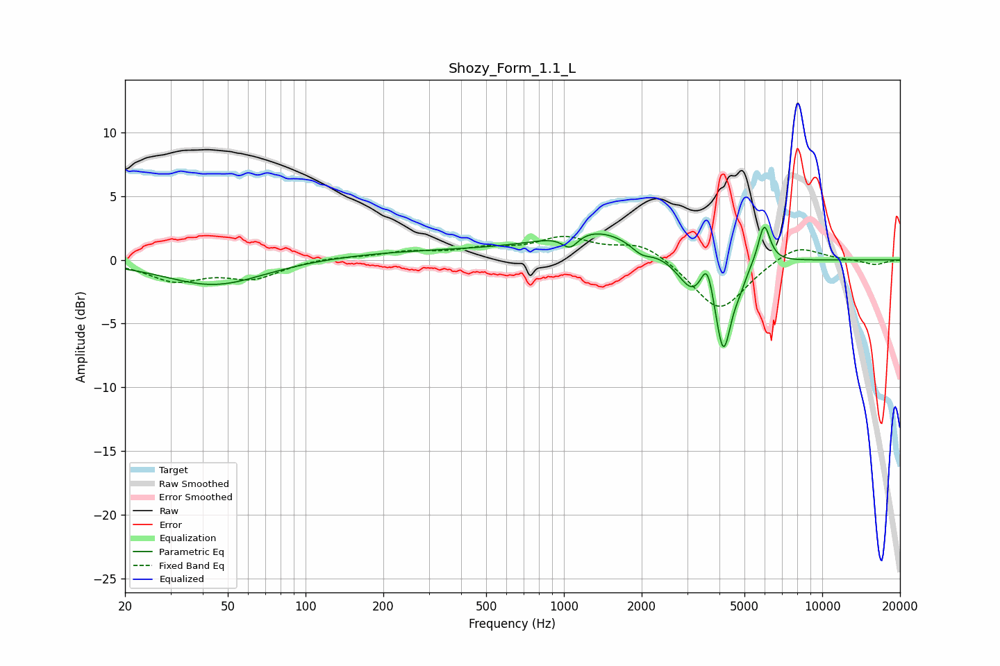

# Shozy_Form_1.1_L
See [usage instructions](https://github.com/jaakkopasanen/AutoEq#usage) for more options and info.

### Parametric EQs
Apply preamp of -2.7 dB when using parametric equalizer.

|   # | Type    |   Fc (Hz) |    Q |   Gain (dB) |
|-----|---------|-----------|------|-------------|
|   1 | Peaking |        44 | 0.74 |        -2   |
|   2 | Peaking |       315 | 0.32 |         0.7 |
|   3 | Peaking |      1057 | 4.44 |        -1.1 |
|   4 | Peaking |      1335 | 0.82 |         2.2 |
|   5 | Peaking |      1994 | 3.54 |        -0.7 |
|   6 | Peaking |      3139 | 2.52 |        -2.5 |
|   7 | Peaking |      3586 | 6    |         2.5 |
|   8 | Peaking |      4142 | 4.5  |        -6.9 |
|   9 | Peaking |      4789 | 5.34 |        -0.9 |
|  10 | Peaking |      5958 | 6    |         3.2 |

### Fixed Band EQs
When using fixed band (also called graphic) equalizer, apply preamp of **-1.9 dB** (if available) and set gains manually with these parameters.

|   # | Type    |   Fc (Hz) |    Q |   Gain (dB) |
|-----|---------|-----------|------|-------------|
|   1 | Peaking |        31 | 1.41 |        -1.5 |
|   2 | Peaking |        62 | 1.41 |        -1.3 |
|   3 | Peaking |       125 | 1.41 |         0.2 |
|   4 | Peaking |       250 | 1.41 |         0.6 |
|   5 | Peaking |       500 | 1.41 |         0.7 |
|   6 | Peaking |      1000 | 1.41 |         1.6 |
|   7 | Peaking |      2000 | 1.41 |         1.4 |
|   8 | Peaking |      4000 | 1.41 |        -4.1 |
|   9 | Peaking |      8000 | 1.41 |         1.3 |
|  10 | Peaking |     16000 | 1.41 |        -0.4 |

### Graphs

