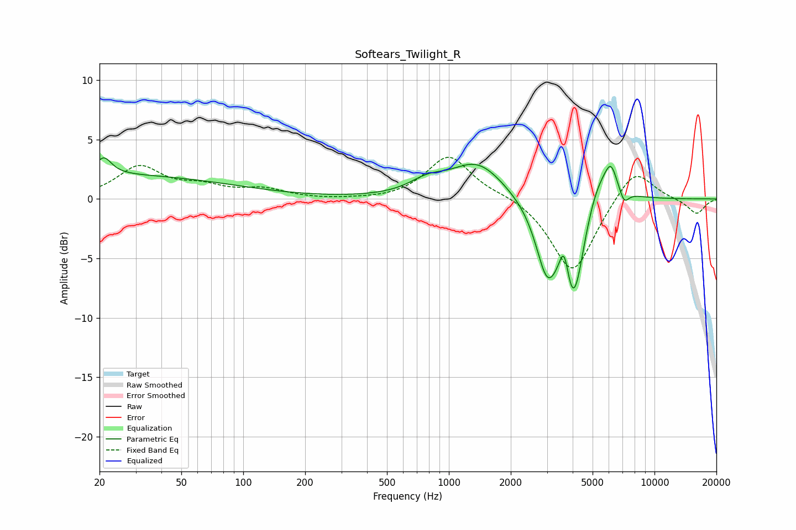

# Softears_Twilight_R
See [usage instructions](https://github.com/jaakkopasanen/AutoEq#usage) for more options and info.

### Parametric EQs
Apply preamp of -3.5 dB when using parametric equalizer.

|   # | Type    |   Fc (Hz) |    Q |   Gain (dB) |
|-----|---------|-----------|------|-------------|
|   1 | Peaking |        20 | 0.2  |         2   |
|   2 | Peaking |        21 | 3.87 |         1.4 |
|   3 | Peaking |       787 | 1.61 |         1   |
|   4 | Peaking |      1378 | 1.1  |         3   |
|   5 | Peaking |      3003 | 2.56 |        -5.6 |
|   6 | Peaking |      3640 | 5.99 |         3.1 |
|   7 | Peaking |      4033 | 2.55 |        -9.1 |
|   8 | Peaking |      5354 | 1.75 |         3.4 |
|   9 | Peaking |      6142 | 4.82 |         1.9 |
|  10 | Peaking |      7116 | 5.91 |        -1.2 |

### Fixed Band EQs
When using fixed band (also called graphic) equalizer, apply preamp of **-3.6 dB** (if available) and set gains manually with these parameters.

|   # | Type    |   Fc (Hz) |    Q |   Gain (dB) |
|-----|---------|-----------|------|-------------|
|   1 | Peaking |        31 | 1.41 |         2.6 |
|   2 | Peaking |        62 | 1.41 |         0.9 |
|   3 | Peaking |       125 | 1.41 |         0.7 |
|   4 | Peaking |       250 | 1.41 |        -0.1 |
|   5 | Peaking |       500 | 1.41 |        -0.1 |
|   6 | Peaking |      1000 | 1.41 |         3.7 |
|   7 | Peaking |      2000 | 1.41 |         0.4 |
|   8 | Peaking |      4000 | 1.41 |        -6.4 |
|   9 | Peaking |      8000 | 1.41 |         2.8 |
|  10 | Peaking |     16000 | 1.41 |        -1.3 |

### Graphs

