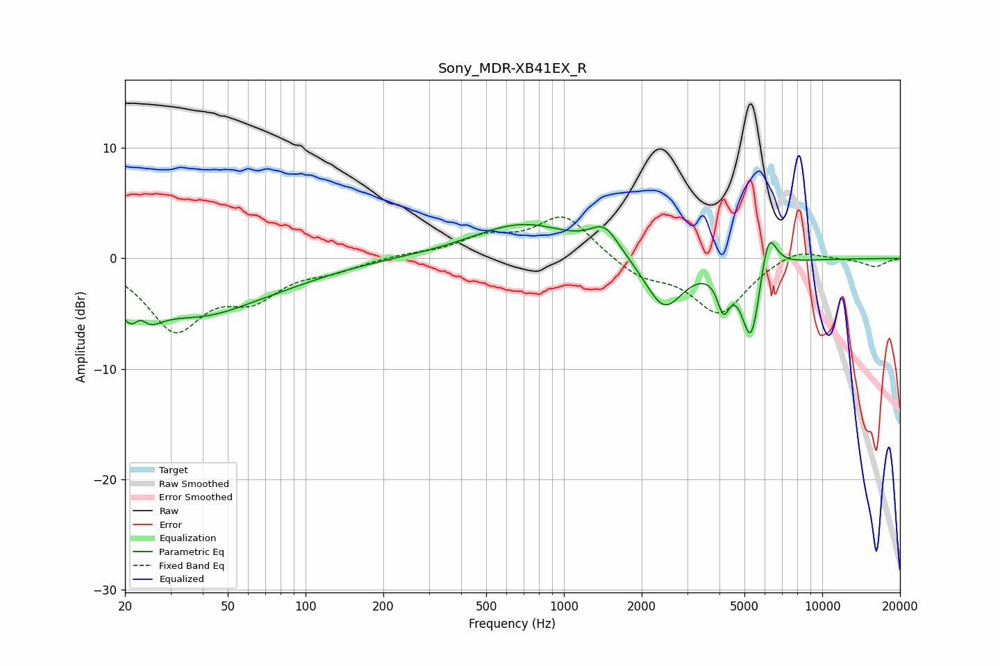

# Sony_MDR-XB41EX_R
See [usage instructions](https://github.com/jaakkopasanen/AutoEq#usage) for more options and info.

### Parametric EQs
Apply preamp of -3.2 dB when using parametric equalizer.

|   # | Type    |   Fc (Hz) |    Q |   Gain (dB) |
|-----|---------|-----------|------|-------------|
|   1 | Peaking |        22 | 2.44 |        -5.5 |
|   2 | Peaking |        23 | 4.69 |         2.8 |
|   3 | Peaking |        39 | 0.63 |        -4.5 |
|   4 | Peaking |        88 | 0.71 |        -0.8 |
|   5 | Peaking |       693 | 0.72 |         3.1 |
|   6 | Peaking |      1437 | 2.52 |         2.3 |
|   7 | Peaking |      2443 | 1.9  |        -4.7 |
|   8 | Peaking |      4145 | 6    |        -3.2 |
|   9 | Peaking |      5306 | 3.77 |        -7.5 |
|  10 | Peaking |      6182 | 4.35 |         4.3 |

### Fixed Band EQs
When using fixed band (also called graphic) equalizer, apply preamp of **-3.8 dB** (if available) and set gains manually with these parameters.

|   # | Type    |   Fc (Hz) |    Q |   Gain (dB) |
|-----|---------|-----------|------|-------------|
|   1 | Peaking |        31 | 1.41 |        -6.2 |
|   2 | Peaking |        62 | 1.41 |        -3   |
|   3 | Peaking |       125 | 1.41 |        -0.9 |
|   4 | Peaking |       250 | 1.41 |         0.3 |
|   5 | Peaking |       500 | 1.41 |         1.7 |
|   6 | Peaking |      1000 | 1.41 |         3.9 |
|   7 | Peaking |      2000 | 1.41 |        -1.6 |
|   8 | Peaking |      4000 | 1.41 |        -4.9 |
|   9 | Peaking |      8000 | 1.41 |         1.1 |
|  10 | Peaking |     16000 | 1.41 |        -0.7 |

### Graphs

