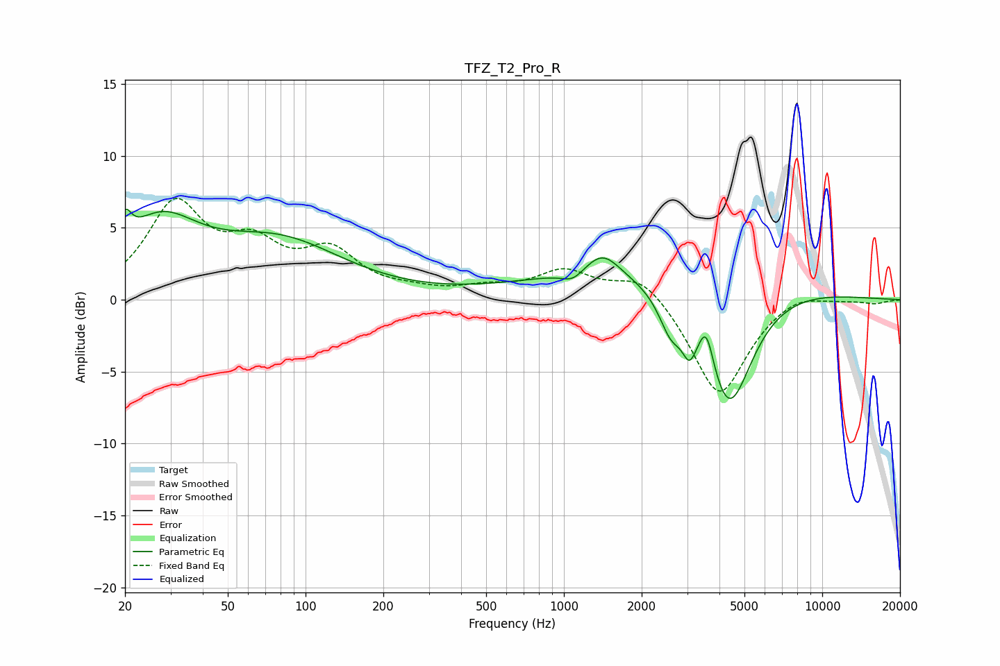

# TFZ_T2_Pro_R
See [usage instructions](https://github.com/jaakkopasanen/AutoEq#usage) for more options and info.

### Parametric EQs
Apply preamp of -6.4 dB when using parametric equalizer.

|   # | Type    |   Fc (Hz) |    Q |   Gain (dB) |
|-----|---------|-----------|------|-------------|
|   1 | Peaking |        20 | 6    |         2   |
|   2 | Peaking |        27 | 0.94 |         4.8 |
|   3 | Peaking |        79 | 0.57 |         3.8 |
|   4 | Peaking |      1082 | 3.44 |        -0.7 |
|   5 | Peaking |      1413 | 2.13 |         1.7 |
|   6 | Peaking |      2494 | 0.26 |         2.2 |
|   7 | Peaking |      2595 | 3.11 |        -2.4 |
|   8 | Peaking |      3061 | 5.38 |        -2   |
|   9 | Peaking |      3562 | 5.21 |         2.5 |
|  10 | Peaking |      4346 | 1.48 |        -9   |

### Fixed Band EQs
When using fixed band (also called graphic) equalizer, apply preamp of **-7.1 dB** (if available) and set gains manually with these parameters.

|   # | Type    |   Fc (Hz) |    Q |   Gain (dB) |
|-----|---------|-----------|------|-------------|
|   1 | Peaking |        31 | 1.41 |         6.4 |
|   2 | Peaking |        62 | 1.41 |         3.1 |
|   3 | Peaking |       125 | 1.41 |         3   |
|   4 | Peaking |       250 | 1.41 |         0.4 |
|   5 | Peaking |       500 | 1.41 |         0.7 |
|   6 | Peaking |      1000 | 1.41 |         1.9 |
|   7 | Peaking |      2000 | 1.41 |         1.9 |
|   8 | Peaking |      4000 | 1.41 |        -6.8 |
|   9 | Peaking |      8000 | 1.41 |         0.7 |
|  10 | Peaking |     16000 | 1.41 |        -0.2 |

### Graphs

