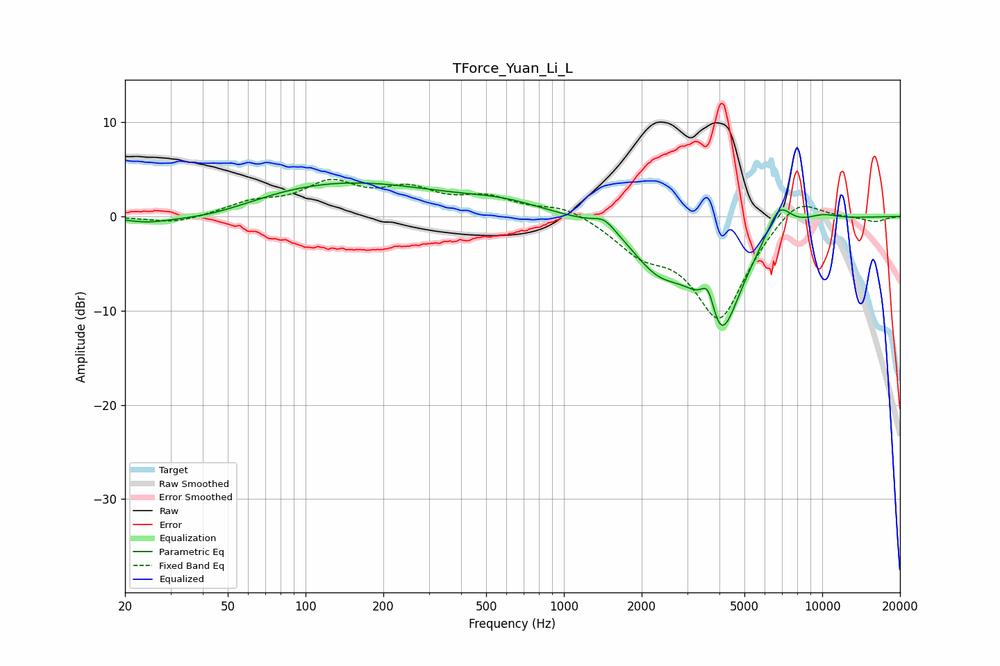

# TForce_Yuan_Li_L
See [usage instructions](https://github.com/jaakkopasanen/AutoEq#usage) for more options and info.

### Parametric EQs
Apply preamp of -3.6 dB when using parametric equalizer.

|   # | Type    |   Fc (Hz) |    Q |   Gain (dB) |
|-----|---------|-----------|------|-------------|
|   1 | Peaking |        24 | 1.61 |        -0.6 |
|   2 | Peaking |        43 | 0.72 |        -1.5 |
|   3 | Peaking |       131 | 0.35 |         3.8 |
|   4 | Peaking |       587 | 0.91 |         1   |
|   5 | Peaking |      1436 | 3.14 |         1.3 |
|   6 | Peaking |      2307 | 1.38 |        -4   |
|   7 | Peaking |      3625 | 4.86 |         3.9 |
|   8 | Peaking |      4018 | 1.67 |       -12.5 |
|   9 | Peaking |      6791 | 2.82 |         3.4 |
|  10 | Peaking |     10000 | 1.94 |         0.7 |

### Fixed Band EQs
When using fixed band (also called graphic) equalizer, apply preamp of **-4.0 dB** (if available) and set gains manually with these parameters.

|   # | Type    |   Fc (Hz) |    Q |   Gain (dB) |
|-----|---------|-----------|------|-------------|
|   1 | Peaking |        31 | 1.41 |        -0.8 |
|   2 | Peaking |        62 | 1.41 |         1.3 |
|   3 | Peaking |       125 | 1.41 |         3.2 |
|   4 | Peaking |       250 | 1.41 |         2.5 |
|   5 | Peaking |       500 | 1.41 |         1.8 |
|   6 | Peaking |      1000 | 1.41 |         1.2 |
|   7 | Peaking |      2000 | 1.41 |        -3   |
|   8 | Peaking |      4000 | 1.41 |       -10.7 |
|   9 | Peaking |      8000 | 1.41 |         2.7 |
|  10 | Peaking |     16000 | 1.41 |        -0.6 |

### Graphs

