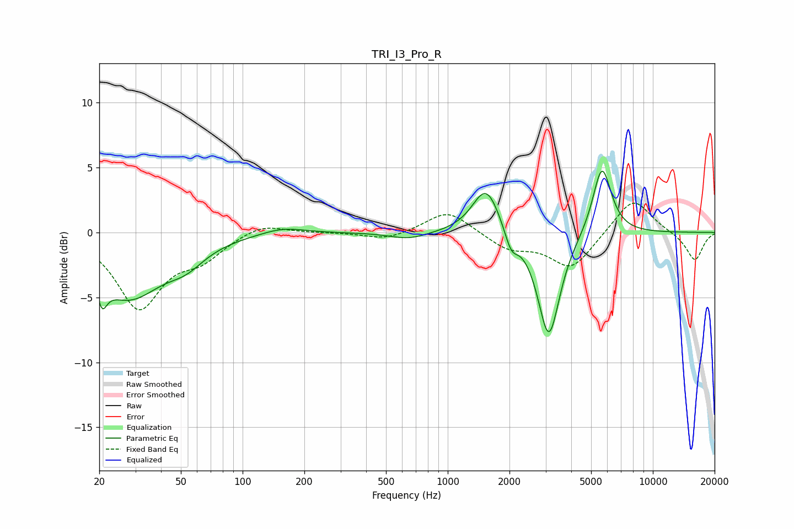

# TRI_I3_Pro_R
See [usage instructions](https://github.com/jaakkopasanen/AutoEq#usage) for more options and info.

### Parametric EQs
Apply preamp of -4.8 dB when using parametric equalizer.

|   # | Type    |   Fc (Hz) |    Q |   Gain (dB) |
|-----|---------|-----------|------|-------------|
|   1 | Peaking |        21 | 5.91 |         3.2 |
|   2 | Peaking |        21 | 5.93 |        -5.1 |
|   3 | Peaking |        28 | 0.85 |        -4.9 |
|   4 | Peaking |        53 | 1.56 |        -1.2 |
|   5 | Peaking |       157 | 1.35 |         0.5 |
|   6 | Peaking |       645 | 1.53 |        -0.5 |
|   7 | Peaking |      1541 | 2.11 |         3.7 |
|   8 | Peaking |      2041 | 4.5  |        -1.5 |
|   9 | Peaking |      3111 | 2.59 |        -8.2 |
|  10 | Peaking |      5647 | 3.04 |         5.3 |

### Fixed Band EQs
When using fixed band (also called graphic) equalizer, apply preamp of **-2.3 dB** (if available) and set gains manually with these parameters.

|   # | Type    |   Fc (Hz) |    Q |   Gain (dB) |
|-----|---------|-----------|------|-------------|
|   1 | Peaking |        31 | 1.41 |        -5.7 |
|   2 | Peaking |        62 | 1.41 |        -1.7 |
|   3 | Peaking |       125 | 1.41 |         0.8 |
|   4 | Peaking |       250 | 1.41 |         0   |
|   5 | Peaking |       500 | 1.41 |        -0.6 |
|   6 | Peaking |      1000 | 1.41 |         1.8 |
|   7 | Peaking |      2000 | 1.41 |        -1.2 |
|   8 | Peaking |      4000 | 1.41 |        -2.8 |
|   9 | Peaking |      8000 | 1.41 |         2.8 |
|  10 | Peaking |     16000 | 1.41 |        -2.2 |

### Graphs

