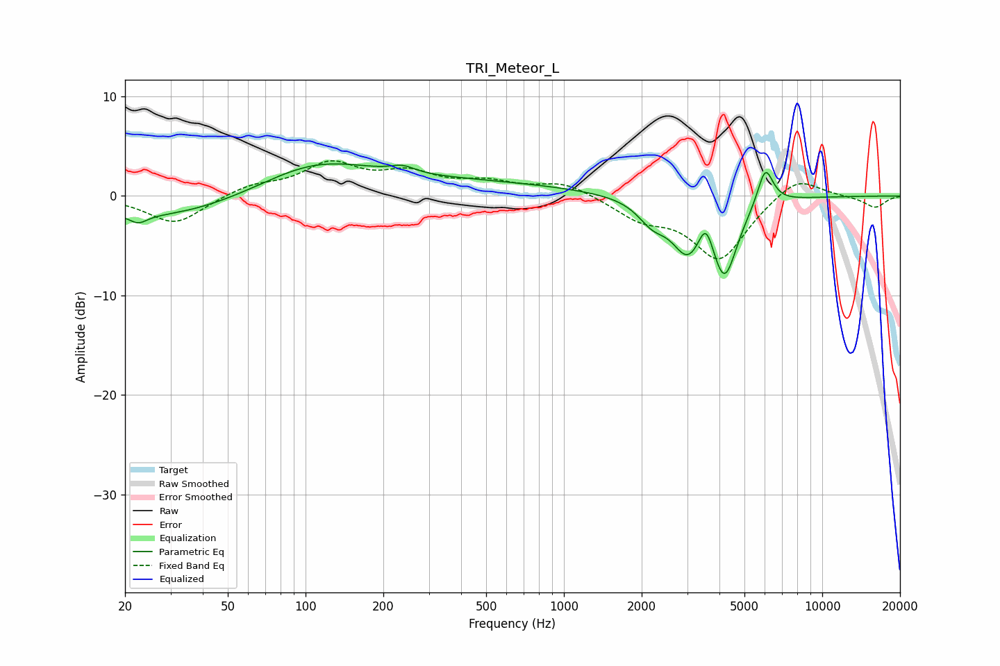

# TRI_Meteor_L
See [usage instructions](https://github.com/jaakkopasanen/AutoEq#usage) for more options and info.

### Parametric EQs
Apply preamp of -3.3 dB when using parametric equalizer.

|   # | Type    |   Fc (Hz) |    Q |   Gain (dB) |
|-----|---------|-----------|------|-------------|
|   1 | Peaking |        22 | 4.14 |        -0.9 |
|   2 | Peaking |        28 | 0.45 |        -2.3 |
|   3 | Peaking |       107 | 0.64 |         3.1 |
|   4 | Peaking |       238 | 3.1  |         0.7 |
|   5 | Peaking |       391 | 0.32 |         1.4 |
|   6 | Peaking |      2200 | 2.53 |        -2   |
|   7 | Peaking |      3013 | 2.29 |        -4.8 |
|   8 | Peaking |      3544 | 4.87 |         3   |
|   9 | Peaking |      4185 | 2.8  |        -7.4 |
|  10 | Peaking |      6020 | 4.53 |         3.9 |

### Fixed Band EQs
When using fixed band (also called graphic) equalizer, apply preamp of **-3.6 dB** (if available) and set gains manually with these parameters.

|   # | Type    |   Fc (Hz) |    Q |   Gain (dB) |
|-----|---------|-----------|------|-------------|
|   1 | Peaking |        31 | 1.41 |        -2.8 |
|   2 | Peaking |        62 | 1.41 |         1   |
|   3 | Peaking |       125 | 1.41 |         3   |
|   4 | Peaking |       250 | 1.41 |         2   |
|   5 | Peaking |       500 | 1.41 |         1.2 |
|   6 | Peaking |      1000 | 1.41 |         1.4 |
|   7 | Peaking |      2000 | 1.41 |        -2   |
|   8 | Peaking |      4000 | 1.41 |        -6.3 |
|   9 | Peaking |      8000 | 1.41 |         2.2 |
|  10 | Peaking |     16000 | 1.41 |        -1.2 |

### Graphs

