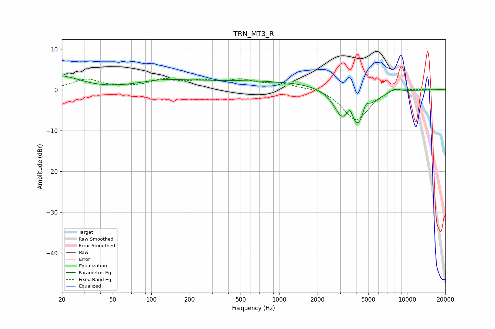

# TRN_MT3_R
See [usage instructions](https://github.com/jaakkopasanen/AutoEq#usage) for more options and info.

### Parametric EQs
Apply preamp of -3.5 dB when using parametric equalizer.

|   # | Type    |   Fc (Hz) |    Q |   Gain (dB) |
|-----|---------|-----------|------|-------------|
|   1 | Peaking |        20 | 0.59 |         4.9 |
|   2 | Peaking |        30 | 0.62 |        -2.1 |
|   3 | Peaking |       118 | 0.85 |         1   |
|   4 | Peaking |       539 | 0.18 |         2.2 |
|   5 | Peaking |      2643 | 2.25 |        -0.8 |
|   6 | Peaking |      3055 | 3.02 |        -3.7 |
|   7 | Peaking |      3587 | 6    |         2.7 |
|   8 | Peaking |      4145 | 1.85 |        -9.5 |
|   9 | Peaking |      4747 | 5.08 |         3   |
|  10 | Peaking |      8057 | 3.38 |         0.9 |

### Fixed Band EQs
When using fixed band (also called graphic) equalizer, apply preamp of **-2.8 dB** (if available) and set gains manually with these parameters.

|   # | Type    |   Fc (Hz) |    Q |   Gain (dB) |
|-----|---------|-----------|------|-------------|
|   1 | Peaking |        31 | 1.41 |         2.5 |
|   2 | Peaking |        62 | 1.41 |         0.3 |
|   3 | Peaking |       125 | 1.41 |         2.2 |
|   4 | Peaking |       250 | 1.41 |         1.7 |
|   5 | Peaking |       500 | 1.41 |         2.1 |
|   6 | Peaking |      1000 | 1.41 |         1.5 |
|   7 | Peaking |      2000 | 1.41 |         0.7 |
|   8 | Peaking |      4000 | 1.41 |        -7.7 |
|   9 | Peaking |      8000 | 1.41 |         1.1 |
|  10 | Peaking |     16000 | 1.41 |         0.1 |

### Graphs

