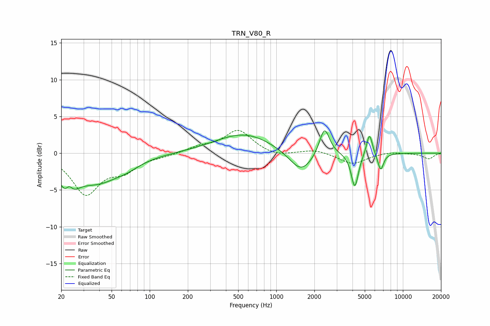

# TRN_V80_R
See [usage instructions](https://github.com/jaakkopasanen/AutoEq#usage) for more options and info.

### Parametric EQs
Apply preamp of -3.1 dB when using parametric equalizer.

|   # | Type    |   Fc (Hz) |    Q |   Gain (dB) |
|-----|---------|-----------|------|-------------|
|   1 | Peaking |        23 | 2.38 |        -4.6 |
|   2 | Peaking |        23 | 4.83 |         2.2 |
|   3 | Peaking |        39 | 0.75 |        -3.6 |
|   4 | Peaking |        67 | 1.51 |        -0.6 |
|   5 | Peaking |       555 | 0.63 |         2.7 |
|   6 | Peaking |      1569 | 1.51 |        -3   |
|   7 | Peaking |      2401 | 3.57 |         3.9 |
|   8 | Peaking |      4170 | 5.02 |        -4.7 |
|   9 | Peaking |      5443 | 6    |         3   |
|  10 | Peaking |      6675 | 5.93 |        -2.4 |

### Fixed Band EQs
When using fixed band (also called graphic) equalizer, apply preamp of **-3.2 dB** (if available) and set gains manually with these parameters.

|   # | Type    |   Fc (Hz) |    Q |   Gain (dB) |
|-----|---------|-----------|------|-------------|
|   1 | Peaking |        31 | 1.41 |        -5.4 |
|   2 | Peaking |        62 | 1.41 |        -2   |
|   3 | Peaking |       125 | 1.41 |        -0.3 |
|   4 | Peaking |       250 | 1.41 |         0.8 |
|   5 | Peaking |       500 | 1.41 |         3.1 |
|   6 | Peaking |      1000 | 1.41 |        -0.5 |
|   7 | Peaking |      2000 | 1.41 |         0.5 |
|   8 | Peaking |      4000 | 1.41 |        -1.5 |
|   9 | Peaking |      8000 | 1.41 |         0.2 |
|  10 | Peaking |     16000 | 1.41 |        -0.8 |

### Graphs

