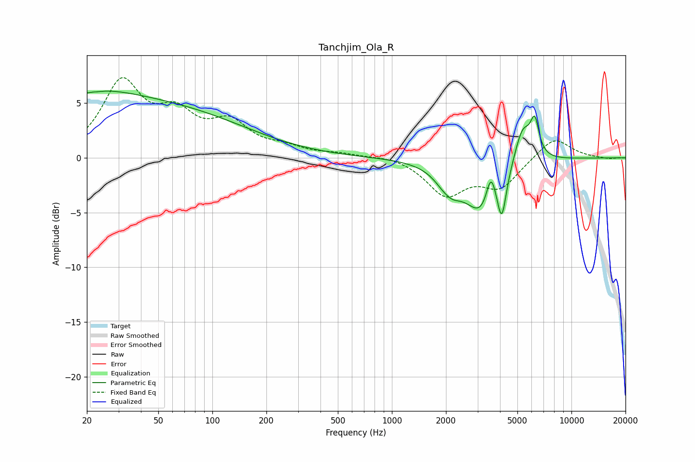

# Tanchjim_Ola_R
See [usage instructions](https://github.com/jaakkopasanen/AutoEq#usage) for more options and info.

### Parametric EQs
Apply preamp of -6.2 dB when using parametric equalizer.

|   # | Type    |   Fc (Hz) |    Q |   Gain (dB) |
|-----|---------|-----------|------|-------------|
|   1 | Peaking |        21 | 0.64 |         1.5 |
|   2 | Peaking |        23 | 5.92 |        -0.1 |
|   3 | Peaking |        38 | 0.23 |         4.9 |
|   4 | Peaking |      2030 | 5.63 |         0.1 |
|   5 | Peaking |      2082 | 2.2  |        -2.1 |
|   6 | Peaking |      3225 | 1.48 |        -5   |
|   7 | Peaking |      3560 | 5.12 |         3.1 |
|   8 | Peaking |      4093 | 5.99 |        -3.7 |
|   9 | Peaking |      5346 | 2.93 |         3.6 |
|  10 | Peaking |      6249 | 5.94 |         3   |

### Fixed Band EQs
When using fixed band (also called graphic) equalizer, apply preamp of **-7.4 dB** (if available) and set gains manually with these parameters.

|   # | Type    |   Fc (Hz) |    Q |   Gain (dB) |
|-----|---------|-----------|------|-------------|
|   1 | Peaking |        31 | 1.41 |         6.6 |
|   2 | Peaking |        62 | 1.41 |         3.3 |
|   3 | Peaking |       125 | 1.41 |         2.8 |
|   4 | Peaking |       250 | 1.41 |         0.7 |
|   5 | Peaking |       500 | 1.41 |         0.3 |
|   6 | Peaking |      1000 | 1.41 |         0.3 |
|   7 | Peaking |      2000 | 1.41 |        -3.3 |
|   8 | Peaking |      4000 | 1.41 |        -2.6 |
|   9 | Peaking |      8000 | 1.41 |         2   |
|  10 | Peaking |     16000 | 1.41 |        -0.1 |

### Graphs

