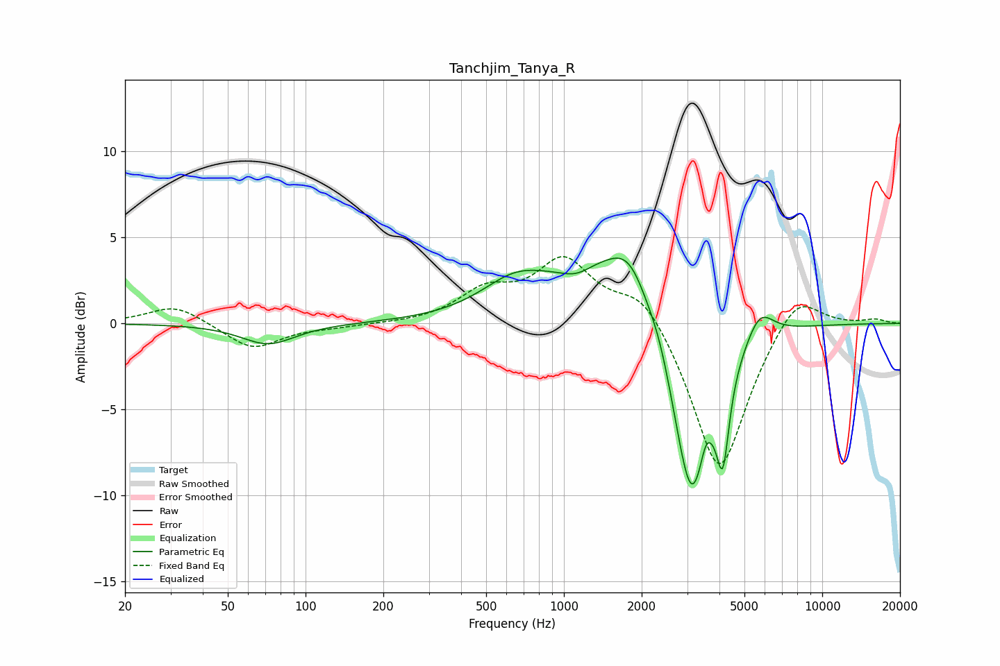

# Tanchjim_Tanya_R
See [usage instructions](https://github.com/jaakkopasanen/AutoEq#usage) for more options and info.

### Parametric EQs
Apply preamp of -3.9 dB when using parametric equalizer.

|   # | Type    |   Fc (Hz) |    Q |   Gain (dB) |
|-----|---------|-----------|------|-------------|
|   1 | Peaking |        72 | 1.36 |        -1.2 |
|   2 | Peaking |       643 | 1.09 |         1.7 |
|   3 | Peaking |      1120 | 2.17 |        -0.7 |
|   4 | Peaking |      1509 | 0.67 |         3.8 |
|   5 | Peaking |      1801 | 1.95 |         2   |
|   6 | Peaking |      2350 | 3.63 |         0.7 |
|   7 | Peaking |      3127 | 1.79 |       -11.7 |
|   8 | Peaking |      3539 | 6    |         1.3 |
|   9 | Peaking |      4124 | 6    |        -4.7 |
|  10 | Peaking |      5722 | 2.59 |         1.8 |

### Fixed Band EQs
When using fixed band (also called graphic) equalizer, apply preamp of **-4.0 dB** (if available) and set gains manually with these parameters.

|   # | Type    |   Fc (Hz) |    Q |   Gain (dB) |
|-----|---------|-----------|------|-------------|
|   1 | Peaking |        31 | 1.41 |         1.1 |
|   2 | Peaking |        62 | 1.41 |        -1.5 |
|   3 | Peaking |       125 | 1.41 |        -0.2 |
|   4 | Peaking |       250 | 1.41 |        -0   |
|   5 | Peaking |       500 | 1.41 |         1.7 |
|   6 | Peaking |      1000 | 1.41 |         3.5 |
|   7 | Peaking |      2000 | 1.41 |         2.1 |
|   8 | Peaking |      4000 | 1.41 |        -8.9 |
|   9 | Peaking |      8000 | 1.41 |         2.2 |
|  10 | Peaking |     16000 | 1.41 |         0.2 |

### Graphs

