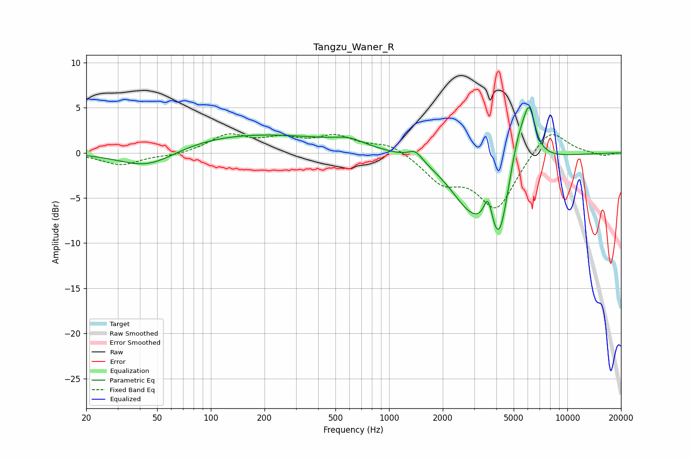

# Tangzu_Waner_R
See [usage instructions](https://github.com/jaakkopasanen/AutoEq#usage) for more options and info.

### Parametric EQs
Apply preamp of -5.1 dB when using parametric equalizer.

|   # | Type    |   Fc (Hz) |    Q |   Gain (dB) |
|-----|---------|-----------|------|-------------|
|   1 | Peaking |        44 | 0.85 |        -2.4 |
|   2 | Peaking |       158 | 0.27 |         2.2 |
|   3 | Peaking |       596 | 1.68 |         0.7 |
|   4 | Peaking |      1404 | 3.58 |         1.1 |
|   5 | Peaking |      2855 | 1.18 |        -4.1 |
|   6 | Peaking |      3589 | 5.72 |         3.3 |
|   7 | Peaking |      4139 | 4.09 |        -2.3 |
|   8 | Peaking |      4225 | 1.4  |        -8.8 |
|   9 | Peaking |      5268 | 1.94 |         7.4 |
|  10 | Peaking |      6119 | 4.25 |         4.5 |

### Fixed Band EQs
When using fixed band (also called graphic) equalizer, apply preamp of **-2.2 dB** (if available) and set gains manually with these parameters.

|   # | Type    |   Fc (Hz) |    Q |   Gain (dB) |
|-----|---------|-----------|------|-------------|
|   1 | Peaking |        31 | 1.41 |        -1.3 |
|   2 | Peaking |        62 | 1.41 |        -0.3 |
|   3 | Peaking |       125 | 1.41 |         1.9 |
|   4 | Peaking |       250 | 1.41 |         1.3 |
|   5 | Peaking |       500 | 1.41 |         1.7 |
|   6 | Peaking |      1000 | 1.41 |         1.1 |
|   7 | Peaking |      2000 | 1.41 |        -2.9 |
|   8 | Peaking |      4000 | 1.41 |        -6   |
|   9 | Peaking |      8000 | 1.41 |         3   |
|  10 | Peaking |     16000 | 1.41 |        -0.4 |

### Graphs

