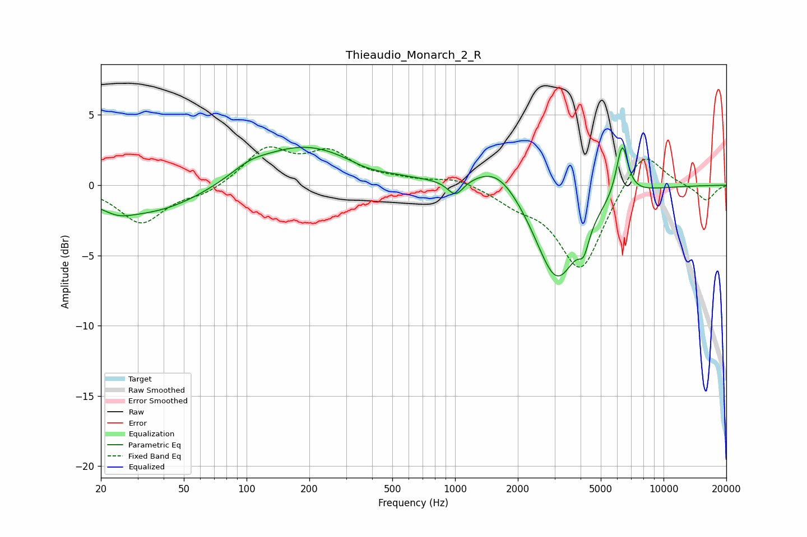

# Thieaudio_Monarch_2_R
See [usage instructions](https://github.com/jaakkopasanen/AutoEq#usage) for more options and info.

### Parametric EQs
Apply preamp of -2.8 dB when using parametric equalizer.

|   # | Type    |   Fc (Hz) |    Q |   Gain (dB) |
|-----|---------|-----------|------|-------------|
|   1 | Peaking |        24 | 1.94 |        -0.5 |
|   2 | Peaking |        35 | 0.54 |        -2.1 |
|   3 | Peaking |       103 | 1.68 |         0.5 |
|   4 | Peaking |       187 | 0.56 |         2.9 |
|   5 | Peaking |       379 | 1.57 |        -0.4 |
|   6 | Peaking |      1005 | 3.71 |        -1.1 |
|   7 | Peaking |      1593 | 1.27 |         1.9 |
|   8 | Peaking |      3077 | 1.35 |        -6.8 |
|   9 | Peaking |      4146 | 5.58 |        -1.5 |
|  10 | Peaking |      6334 | 4.9  |         3.8 |

### Fixed Band EQs
When using fixed band (also called graphic) equalizer, apply preamp of **-2.8 dB** (if available) and set gains manually with these parameters.

|   # | Type    |   Fc (Hz) |    Q |   Gain (dB) |
|-----|---------|-----------|------|-------------|
|   1 | Peaking |        31 | 1.41 |        -2.7 |
|   2 | Peaking |        62 | 1.41 |        -0.6 |
|   3 | Peaking |       125 | 1.41 |         2.5 |
|   4 | Peaking |       250 | 1.41 |         2.1 |
|   5 | Peaking |       500 | 1.41 |         0.3 |
|   6 | Peaking |      1000 | 1.41 |         0.6 |
|   7 | Peaking |      2000 | 1.41 |        -1   |
|   8 | Peaking |      4000 | 1.41 |        -6.1 |
|   9 | Peaking |      8000 | 1.41 |         2.8 |
|  10 | Peaking |     16000 | 1.41 |        -1.1 |

### Graphs

