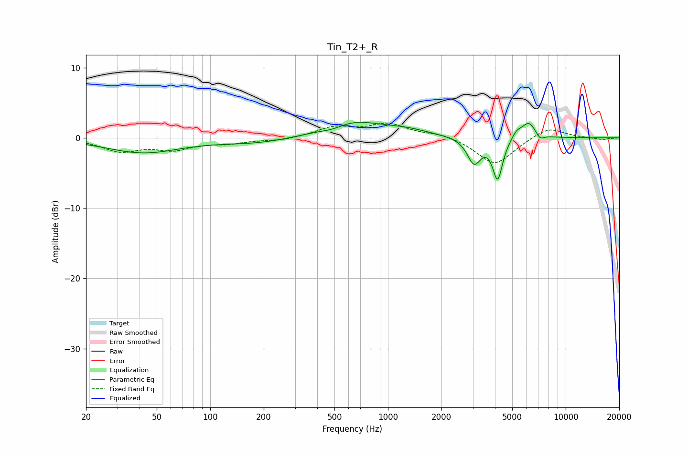

# Tin_T2+_R
See [usage instructions](https://github.com/jaakkopasanen/AutoEq#usage) for more options and info.

### Parametric EQs
Apply preamp of -2.3 dB when using parametric equalizer.

|   # | Type    |   Fc (Hz) |    Q |   Gain (dB) |
|-----|---------|-----------|------|-------------|
|   1 | Peaking |        42 | 0.68 |        -2.1 |
|   2 | Peaking |       185 | 0.68 |        -0.7 |
|   3 | Peaking |       489 | 2.04 |        -0.6 |
|   4 | Peaking |       618 | 0.85 |         2.4 |
|   5 | Peaking |      1273 | 1.07 |         0.8 |
|   6 | Peaking |      3053 | 3.7  |        -3.6 |
|   7 | Peaking |      4141 | 5.05 |        -5.8 |
|   8 | Peaking |      5290 | 5.58 |         0.9 |
|   9 | Peaking |      6190 | 3.26 |         2.4 |
|  10 | Peaking |      7170 | 5.77 |        -0.9 |

### Fixed Band EQs
When using fixed band (also called graphic) equalizer, apply preamp of **-2.2 dB** (if available) and set gains manually with these parameters.

|   # | Type    |   Fc (Hz) |    Q |   Gain (dB) |
|-----|---------|-----------|------|-------------|
|   1 | Peaking |        31 | 1.41 |        -1.8 |
|   2 | Peaking |        62 | 1.41 |        -1.5 |
|   3 | Peaking |       125 | 1.41 |        -0.6 |
|   4 | Peaking |       250 | 1.41 |        -0.4 |
|   5 | Peaking |       500 | 1.41 |         1.4 |
|   6 | Peaking |      1000 | 1.41 |         1.9 |
|   7 | Peaking |      2000 | 1.41 |         0.6 |
|   8 | Peaking |      4000 | 1.41 |        -3.9 |
|   9 | Peaking |      8000 | 1.41 |         1.6 |
|  10 | Peaking |     16000 | 1.41 |        -0.3 |

### Graphs

