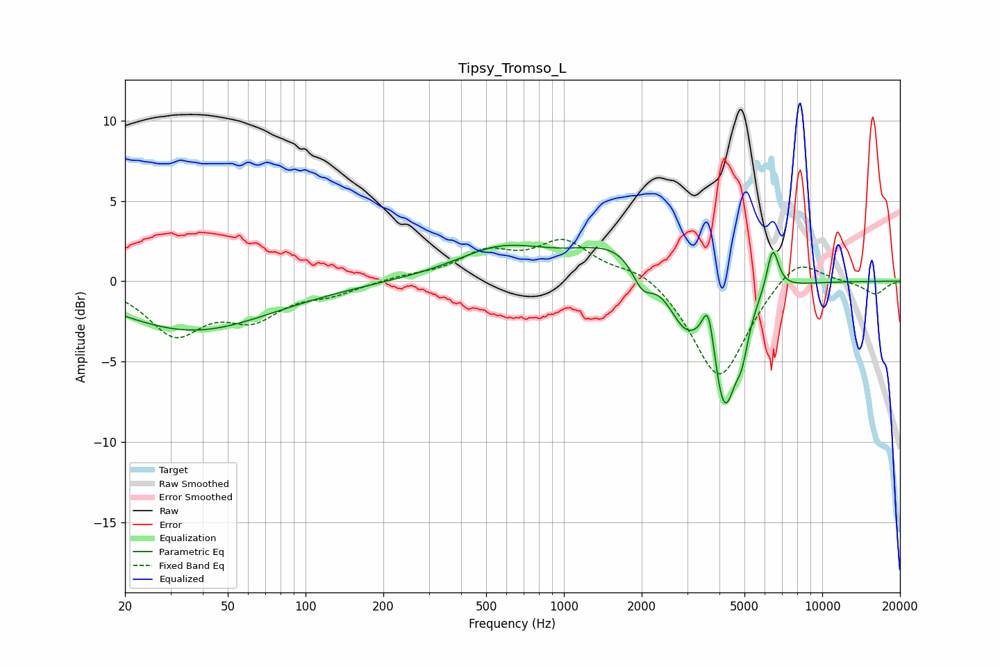

# Tipsy_Tromso_L
See [usage instructions](https://github.com/jaakkopasanen/AutoEq#usage) for more options and info.

### Parametric EQs
Apply preamp of -2.3 dB when using parametric equalizer.

|   # | Type    |   Fc (Hz) |    Q |   Gain (dB) |
|-----|---------|-----------|------|-------------|
|   1 | Peaking |        35 | 0.5  |        -2.6 |
|   2 | Peaking |        57 | 0.44 |        -0.5 |
|   3 | Peaking |       570 | 0.8  |         1.9 |
|   4 | Peaking |      1739 | 0.78 |         2.5 |
|   5 | Peaking |      2015 | 3.25 |        -1.9 |
|   6 | Peaking |      2933 | 1.96 |        -3.1 |
|   7 | Peaking |      3629 | 5.99 |         3.1 |
|   8 | Peaking |      4181 | 2.83 |        -7.7 |
|   9 | Peaking |      4895 | 5.96 |        -1.8 |
|  10 | Peaking |      6431 | 5.92 |         2.8 |

### Fixed Band EQs
When using fixed band (also called graphic) equalizer, apply preamp of **-2.7 dB** (if available) and set gains manually with these parameters.

|   # | Type    |   Fc (Hz) |    Q |   Gain (dB) |
|-----|---------|-----------|------|-------------|
|   1 | Peaking |        31 | 1.41 |        -3.1 |
|   2 | Peaking |        62 | 1.41 |        -2   |
|   3 | Peaking |       125 | 1.41 |        -0.7 |
|   4 | Peaking |       250 | 1.41 |         0.3 |
|   5 | Peaking |       500 | 1.41 |         1.6 |
|   6 | Peaking |      1000 | 1.41 |         2.3 |
|   7 | Peaking |      2000 | 1.41 |         0.9 |
|   8 | Peaking |      4000 | 1.41 |        -6.3 |
|   9 | Peaking |      8000 | 1.41 |         1.7 |
|  10 | Peaking |     16000 | 1.41 |        -0.8 |

### Graphs

