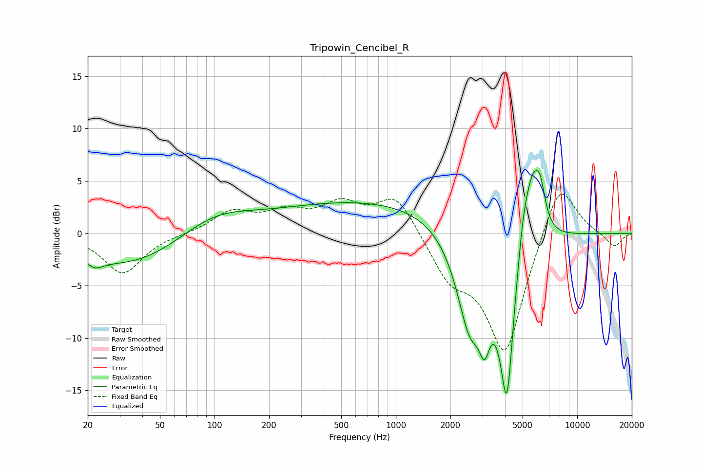

# Tripowin_Cencibel_R
See [usage instructions](https://github.com/jaakkopasanen/AutoEq#usage) for more options and info.

### Parametric EQs
Apply preamp of -6.1 dB when using parametric equalizer.

|   # | Type    |   Fc (Hz) |    Q |   Gain (dB) |
|-----|---------|-----------|------|-------------|
|   1 | Peaking |        22 | 3.02 |        -0.9 |
|   2 | Peaking |        35 | 0.47 |        -3.3 |
|   3 | Peaking |        98 | 0.67 |         2.3 |
|   4 | Peaking |       763 | 0.26 |         3.1 |
|   5 | Peaking |      2561 | 1.82 |        -9.3 |
|   6 | Peaking |      3086 | 4.75 |        -4.1 |
|   7 | Peaking |      4097 | 3.23 |       -15.6 |
|   8 | Peaking |      5074 | 3.52 |         4.9 |
|   9 | Peaking |      5666 | 4.23 |         3.8 |
|  10 | Peaking |      6220 | 4.32 |         4.4 |

### Fixed Band EQs
When using fixed band (also called graphic) equalizer, apply preamp of **-3.8 dB** (if available) and set gains manually with these parameters.

|   # | Type    |   Fc (Hz) |    Q |   Gain (dB) |
|-----|---------|-----------|------|-------------|
|   1 | Peaking |        31 | 1.41 |        -3.9 |
|   2 | Peaking |        62 | 1.41 |        -0.1 |
|   3 | Peaking |       125 | 1.41 |         2   |
|   4 | Peaking |       250 | 1.41 |         1.7 |
|   5 | Peaking |       500 | 1.41 |         2.5 |
|   6 | Peaking |      1000 | 1.41 |         3.7 |
|   7 | Peaking |      2000 | 1.41 |        -3.6 |
|   8 | Peaking |      4000 | 1.41 |       -11.5 |
|   9 | Peaking |      8000 | 1.41 |         5.7 |
|  10 | Peaking |     16000 | 1.41 |        -1.4 |

### Graphs

