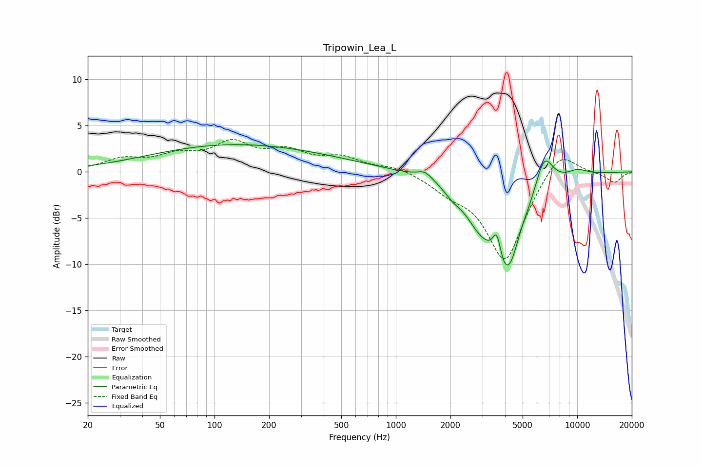

# Tripowin_Lea_L
See [usage instructions](https://github.com/jaakkopasanen/AutoEq#usage) for more options and info.

### Parametric EQs
Apply preamp of -3.0 dB when using parametric equalizer.

|   # | Type    |   Fc (Hz) |    Q |   Gain (dB) |
|-----|---------|-----------|------|-------------|
|   1 | Peaking |       128 | 0.3  |         2.9 |
|   2 | Peaking |       500 | 0.62 |         0.3 |
|   3 | Peaking |      1448 | 3.49 |         0.8 |
|   4 | Peaking |      2057 | 3.17 |        -0.7 |
|   5 | Peaking |      2860 | 1.76 |        -2.4 |
|   6 | Peaking |      3607 | 6    |         3.2 |
|   7 | Peaking |      4097 | 1.5  |       -11   |
|   8 | Peaking |      4864 | 3.5  |         0.9 |
|   9 | Peaking |      6554 | 2.69 |         4.2 |
|  10 | Peaking |     10000 | 2.13 |         0.7 |

### Fixed Band EQs
When using fixed band (also called graphic) equalizer, apply preamp of **-3.6 dB** (if available) and set gains manually with these parameters.

|   # | Type    |   Fc (Hz) |    Q |   Gain (dB) |
|-----|---------|-----------|------|-------------|
|   1 | Peaking |        31 | 1.41 |         1.2 |
|   2 | Peaking |        62 | 1.41 |         1.5 |
|   3 | Peaking |       125 | 1.41 |         2.8 |
|   4 | Peaking |       250 | 1.41 |         1.9 |
|   5 | Peaking |       500 | 1.41 |         1.4 |
|   6 | Peaking |      1000 | 1.41 |         0.6 |
|   7 | Peaking |      2000 | 1.41 |        -1.5 |
|   8 | Peaking |      4000 | 1.41 |        -9.6 |
|   9 | Peaking |      8000 | 1.41 |         2.8 |
|  10 | Peaking |     16000 | 1.41 |        -1.2 |

### Graphs

