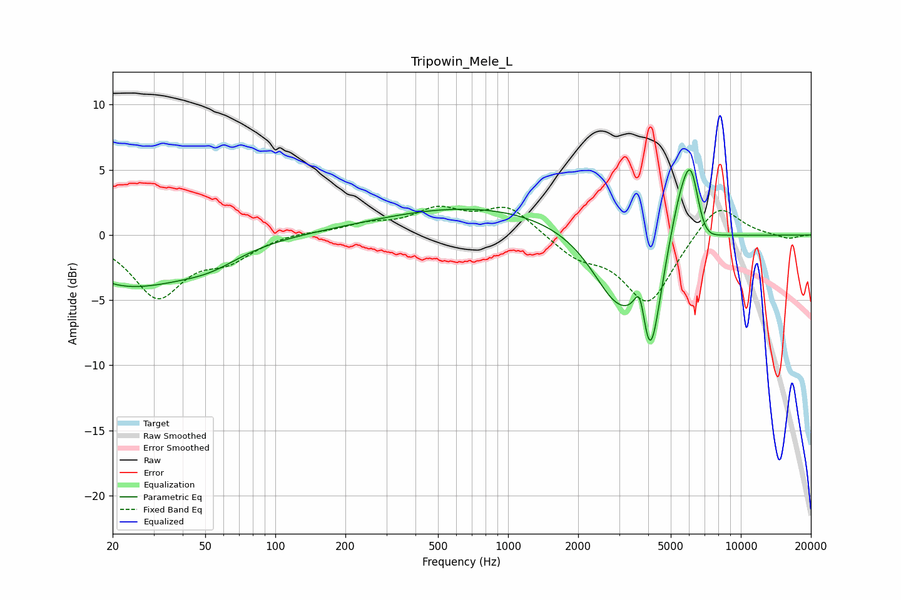

# Tripowin_Mele_L
See [usage instructions](https://github.com/jaakkopasanen/AutoEq#usage) for more options and info.

### Parametric EQs
Apply preamp of -5.1 dB when using parametric equalizer.

|   # | Type    |   Fc (Hz) |    Q |   Gain (dB) |
|-----|---------|-----------|------|-------------|
|   1 | Peaking |        21 | 0.7  |        -2.9 |
|   2 | Peaking |        35 | 0.76 |        -1.2 |
|   3 | Peaking |        53 | 1.05 |        -1.2 |
|   4 | Peaking |       761 | 0.33 |         2.2 |
|   5 | Peaking |      2943 | 1.25 |        -5.2 |
|   6 | Peaking |      3693 | 5.53 |         3.5 |
|   7 | Peaking |      4066 | 2.96 |        -8.7 |
|   8 | Peaking |      5526 | 2.32 |         4.3 |
|   9 | Peaking |      6129 | 3.81 |         4.3 |
|  10 | Peaking |      6885 | 2.76 |        -1.6 |

### Fixed Band EQs
When using fixed band (also called graphic) equalizer, apply preamp of **-2.3 dB** (if available) and set gains manually with these parameters.

|   # | Type    |   Fc (Hz) |    Q |   Gain (dB) |
|-----|---------|-----------|------|-------------|
|   1 | Peaking |        31 | 1.41 |        -4.6 |
|   2 | Peaking |        62 | 1.41 |        -1.6 |
|   3 | Peaking |       125 | 1.41 |         0.3 |
|   4 | Peaking |       250 | 1.41 |         0.7 |
|   5 | Peaking |       500 | 1.41 |         1.8 |
|   6 | Peaking |      1000 | 1.41 |         2.2 |
|   7 | Peaking |      2000 | 1.41 |        -1.5 |
|   8 | Peaking |      4000 | 1.41 |        -5.3 |
|   9 | Peaking |      8000 | 1.41 |         2.7 |
|  10 | Peaking |     16000 | 1.41 |        -0.3 |

### Graphs

