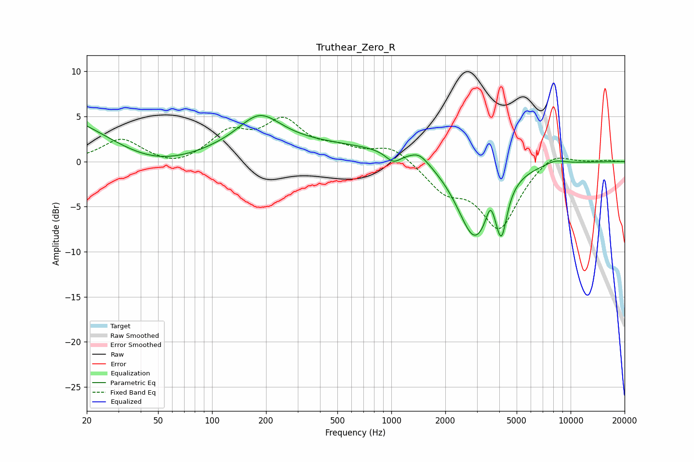

# Truthear_Zero_R
See [usage instructions](https://github.com/jaakkopasanen/AutoEq#usage) for more options and info.

### Parametric EQs
Apply preamp of -5.2 dB when using parametric equalizer.

|   # | Type    |   Fc (Hz) |    Q |   Gain (dB) |
|-----|---------|-----------|------|-------------|
|   1 | Peaking |        29 | 0.18 |        11.4 |
|   2 | Peaking |        47 | 0.34 |       -10.6 |
|   3 | Peaking |       184 | 1.24 |         3.2 |
|   4 | Peaking |       768 | 0.18 |         1.7 |
|   5 | Peaking |      1024 | 3.39 |        -1.2 |
|   6 | Peaking |      1434 | 2.85 |         1   |
|   7 | Peaking |      2916 | 1.37 |        -9.3 |
|   8 | Peaking |      3570 | 6    |         2.1 |
|   9 | Peaking |      4113 | 4.72 |        -5   |
|  10 | Peaking |      8211 | 2.45 |         0.5 |

### Fixed Band EQs
When using fixed band (also called graphic) equalizer, apply preamp of **-5.0 dB** (if available) and set gains manually with these parameters.

|   # | Type    |   Fc (Hz) |    Q |   Gain (dB) |
|-----|---------|-----------|------|-------------|
|   1 | Peaking |        31 | 1.41 |         2.5 |
|   2 | Peaking |        62 | 1.41 |        -0.8 |
|   3 | Peaking |       125 | 1.41 |         3   |
|   4 | Peaking |       250 | 1.41 |         4.2 |
|   5 | Peaking |       500 | 1.41 |         1.1 |
|   6 | Peaking |      1000 | 1.41 |         1.7 |
|   7 | Peaking |      2000 | 1.41 |        -2.9 |
|   8 | Peaking |      4000 | 1.41 |        -7.2 |
|   9 | Peaking |      8000 | 1.41 |         1.4 |
|  10 | Peaking |     16000 | 1.41 |         0.1 |

### Graphs

