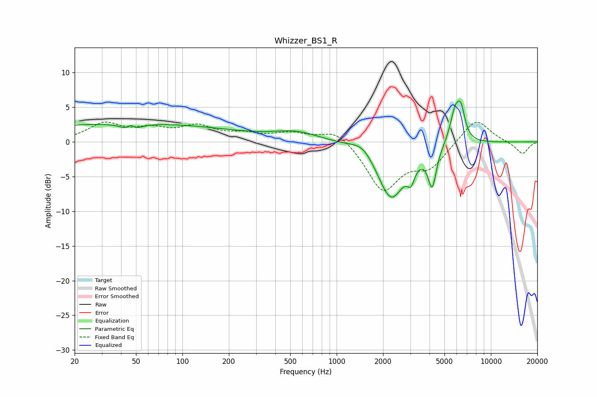

# Whizzer_BS1_R
See [usage instructions](https://github.com/jaakkopasanen/AutoEq#usage) for more options and info.

### Parametric EQs
Apply preamp of -6.0 dB when using parametric equalizer.

|   # | Type    |   Fc (Hz) |    Q |   Gain (dB) |
|-----|---------|-----------|------|-------------|
|   1 | Peaking |        43 | 0.18 |         2.7 |
|   2 | Peaking |        46 | 3.7  |        -2.5 |
|   3 | Peaking |        46 | 5.42 |         2.2 |
|   4 | Peaking |       549 | 0.97 |         1.3 |
|   5 | Peaking |      1481 | 1.97 |         1.5 |
|   6 | Peaking |      2251 | 1.57 |        -8.2 |
|   7 | Peaking |      3036 | 5.98 |        -2.2 |
|   8 | Peaking |      4165 | 5.34 |        -5.5 |
|   9 | Peaking |      5873 | 4.11 |         4.5 |
|  10 | Peaking |      6413 | 5.36 |         3.6 |

### Fixed Band EQs
When using fixed band (also called graphic) equalizer, apply preamp of **-2.9 dB** (if available) and set gains manually with these parameters.

|   # | Type    |   Fc (Hz) |    Q |   Gain (dB) |
|-----|---------|-----------|------|-------------|
|   1 | Peaking |        31 | 1.41 |         2.5 |
|   2 | Peaking |        62 | 1.41 |         1.5 |
|   3 | Peaking |       125 | 1.41 |         2   |
|   4 | Peaking |       250 | 1.41 |         0.9 |
|   5 | Peaking |       500 | 1.41 |         1.1 |
|   6 | Peaking |      1000 | 1.41 |         2   |
|   7 | Peaking |      2000 | 1.41 |        -6.9 |
|   8 | Peaking |      4000 | 1.41 |        -3.3 |
|   9 | Peaking |      8000 | 1.41 |         3.5 |
|  10 | Peaking |     16000 | 1.41 |        -1.8 |

### Graphs

