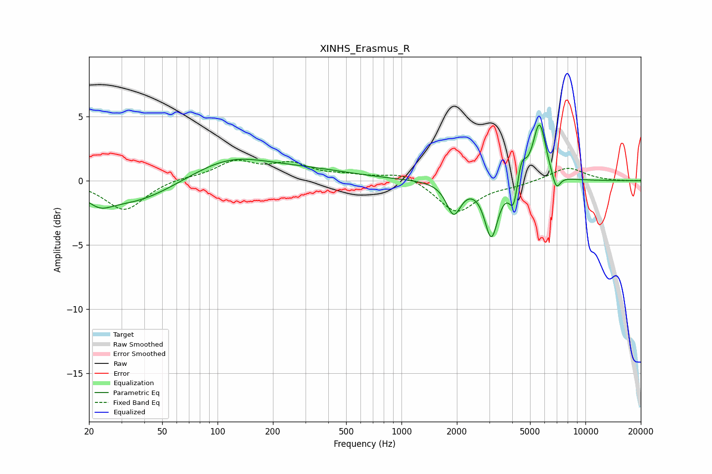

# XINHS_Erasmus_R
See [usage instructions](https://github.com/jaakkopasanen/AutoEq#usage) for more options and info.

### Parametric EQs
Apply preamp of -4.4 dB when using parametric equalizer.

|   # | Type    |   Fc (Hz) |    Q |   Gain (dB) |
|-----|---------|-----------|------|-------------|
|   1 | Peaking |        23 | 2.18 |        -0.9 |
|   2 | Peaking |        34 | 0.63 |        -1.8 |
|   3 | Peaking |       116 | 0.65 |         1.8 |
|   4 | Peaking |       324 | 0.57 |         0.6 |
|   5 | Peaking |      1922 | 3.63 |        -2.4 |
|   6 | Peaking |      3080 | 3.89 |        -4.3 |
|   7 | Peaking |      4071 | 6    |        -2.2 |
|   8 | Peaking |      4485 | 6    |         1.7 |
|   9 | Peaking |      5623 | 3.9  |         4.6 |
|  10 | Peaking |      6929 | 5.91 |        -1.3 |

### Fixed Band EQs
When using fixed band (also called graphic) equalizer, apply preamp of **-1.7 dB** (if available) and set gains manually with these parameters.

|   # | Type    |   Fc (Hz) |    Q |   Gain (dB) |
|-----|---------|-----------|------|-------------|
|   1 | Peaking |        31 | 1.41 |        -2.3 |
|   2 | Peaking |        62 | 1.41 |         0.2 |
|   3 | Peaking |       125 | 1.41 |         1.4 |
|   4 | Peaking |       250 | 1.41 |         1.2 |
|   5 | Peaking |       500 | 1.41 |         0.3 |
|   6 | Peaking |      1000 | 1.41 |         0.7 |
|   7 | Peaking |      2000 | 1.41 |        -2.5 |
|   8 | Peaking |      4000 | 1.41 |        -0.3 |
|   9 | Peaking |      8000 | 1.41 |         1.1 |
|  10 | Peaking |     16000 | 1.41 |        -0   |

### Graphs

