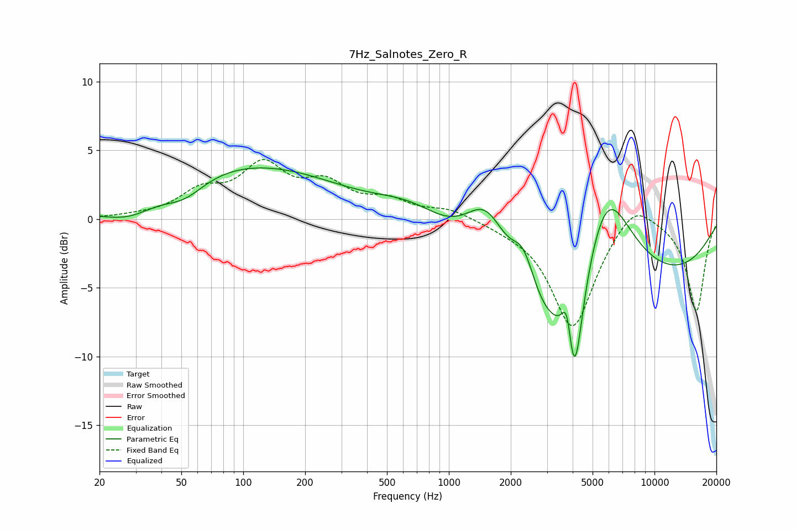

# 7Hz_Salnotes_Zero_R
See [usage instructions](https://github.com/jaakkopasanen/AutoEq#usage) for more options and info.

### Parametric EQs
Apply preamp of -3.8 dB when using parametric equalizer.

|   # | Type    |   Fc (Hz) |    Q |   Gain (dB) |
|-----|---------|-----------|------|-------------|
|   1 | Peaking |        28 | 1.06 |        -1.4 |
|   2 | Peaking |        52 | 1.38 |        -1.4 |
|   3 | Peaking |       120 | 0.27 |         4.3 |
|   4 | Peaking |       700 | 0.58 |         6.3 |
|   5 | Peaking |      1541 | 0.97 |         9.5 |
|   6 | Peaking |      2307 | 2.27 |         3.9 |
|   7 | Peaking |      3091 | 0.23 |       -19.4 |
|   8 | Peaking |      3758 | 5.74 |         3.4 |
|   9 | Peaking |      4063 | 3.65 |        -7.7 |
|  10 | Peaking |      5788 | 0.69 |        16.4 |

### Fixed Band EQs
When using fixed band (also called graphic) equalizer, apply preamp of **-4.4 dB** (if available) and set gains manually with these parameters.

|   # | Type    |   Fc (Hz) |    Q |   Gain (dB) |
|-----|---------|-----------|------|-------------|
|   1 | Peaking |        31 | 1.41 |         0.1 |
|   2 | Peaking |        62 | 1.41 |         1.8 |
|   3 | Peaking |       125 | 1.41 |         3.6 |
|   4 | Peaking |       250 | 1.41 |         2.2 |
|   5 | Peaking |       500 | 1.41 |         1.2 |
|   6 | Peaking |      1000 | 1.41 |         0.7 |
|   7 | Peaking |      2000 | 1.41 |        -0.3 |
|   8 | Peaking |      4000 | 1.41 |        -7.9 |
|   9 | Peaking |      8000 | 1.41 |         1.8 |
|  10 | Peaking |     16000 | 1.41 |        -6.7 |

### Graphs

