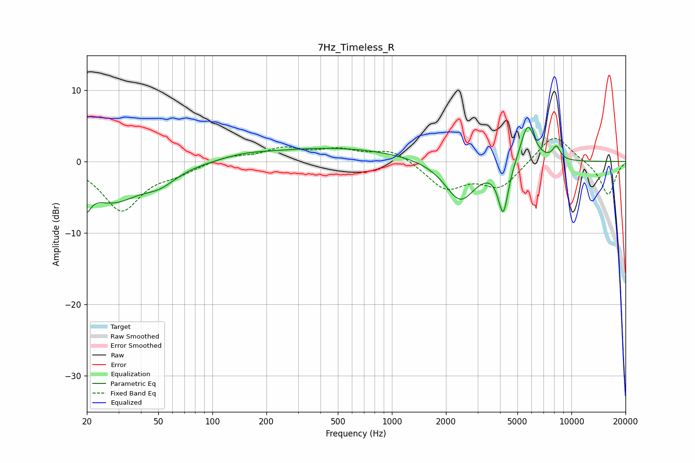

# 7Hz_Timeless_R
See [usage instructions](https://github.com/jaakkopasanen/AutoEq#usage) for more options and info.

### Parametric EQs
Apply preamp of -4.9 dB when using parametric equalizer.

|   # | Type    |   Fc (Hz) |    Q |   Gain (dB) |
|-----|---------|-----------|------|-------------|
|   1 | Peaking |        20 | 5.71 |        -6.3 |
|   2 | Peaking |        20 | 5.96 |         3.2 |
|   3 | Peaking |        28 | 0.9  |        -5.3 |
|   4 | Peaking |        51 | 1.53 |        -1.8 |
|   5 | Peaking |       150 | 1.15 |         0.5 |
|   6 | Peaking |       475 | 0.36 |         1.9 |
|   7 | Peaking |      2402 | 1.64 |        -5.7 |
|   8 | Peaking |      4171 | 4.96 |        -6.9 |
|   9 | Peaking |      5703 | 3.41 |         5.7 |
|  10 | Peaking |      8250 | 6    |         1.8 |

### Fixed Band EQs
When using fixed band (also called graphic) equalizer, apply preamp of **-3.3 dB** (if available) and set gains manually with these parameters.

|   # | Type    |   Fc (Hz) |    Q |   Gain (dB) |
|-----|---------|-----------|------|-------------|
|   1 | Peaking |        31 | 1.41 |        -6.8 |
|   2 | Peaking |        62 | 1.41 |        -1.3 |
|   3 | Peaking |       125 | 1.41 |         0.8 |
|   4 | Peaking |       250 | 1.41 |         1.7 |
|   5 | Peaking |       500 | 1.41 |         1.4 |
|   6 | Peaking |      1000 | 1.41 |         1.7 |
|   7 | Peaking |      2000 | 1.41 |        -3.7 |
|   8 | Peaking |      4000 | 1.41 |        -3.6 |
|   9 | Peaking |      8000 | 1.41 |         4.1 |
|  10 | Peaking |     16000 | 1.41 |        -4.8 |

### Graphs

