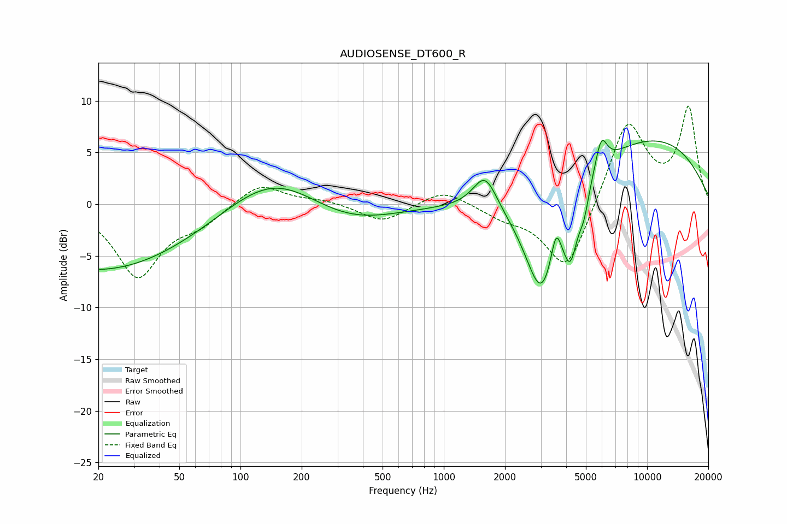

# AUDIOSENSE_DT600_R
See [usage instructions](https://github.com/jaakkopasanen/AutoEq#usage) for more options and info.

### Parametric EQs
Apply preamp of -6.2 dB when using parametric equalizer.

|   # | Type    |   Fc (Hz) |    Q |   Gain (dB) |
|-----|---------|-----------|------|-------------|
|   1 | Peaking |        20 | 0.29 |        -6.5 |
|   2 | Peaking |       146 | 0.62 |         3.8 |
|   3 | Peaking |       330 | 0.61 |        -2.2 |
|   4 | Peaking |      1596 | 2.41 |         3.4 |
|   5 | Peaking |      3025 | 1.61 |       -10.5 |
|   6 | Peaking |      3563 | 5.98 |         2.9 |
|   7 | Peaking |      4202 | 3.94 |        -5.1 |
|   8 | Peaking |      4892 | 5.76 |        -2   |
|   9 | Peaking |      5947 | 4.71 |         3.1 |
|  10 | Peaking |     10000 | 0.33 |         6.4 |

### Fixed Band EQs
When using fixed band (also called graphic) equalizer, apply preamp of **-9.6 dB** (if available) and set gains manually with these parameters.

|   # | Type    |   Fc (Hz) |    Q |   Gain (dB) |
|-----|---------|-----------|------|-------------|
|   1 | Peaking |        31 | 1.41 |        -6.9 |
|   2 | Peaking |        62 | 1.41 |        -1.6 |
|   3 | Peaking |       125 | 1.41 |         2.1 |
|   4 | Peaking |       250 | 1.41 |         0.4 |
|   5 | Peaking |       500 | 1.41 |        -1.8 |
|   6 | Peaking |      1000 | 1.41 |         1.5 |
|   7 | Peaking |      2000 | 1.41 |        -1.1 |
|   8 | Peaking |      4000 | 1.41 |        -6.8 |
|   9 | Peaking |      8000 | 1.41 |         8.2 |
|  10 | Peaking |     16000 | 1.41 |         9.2 |

### Graphs

