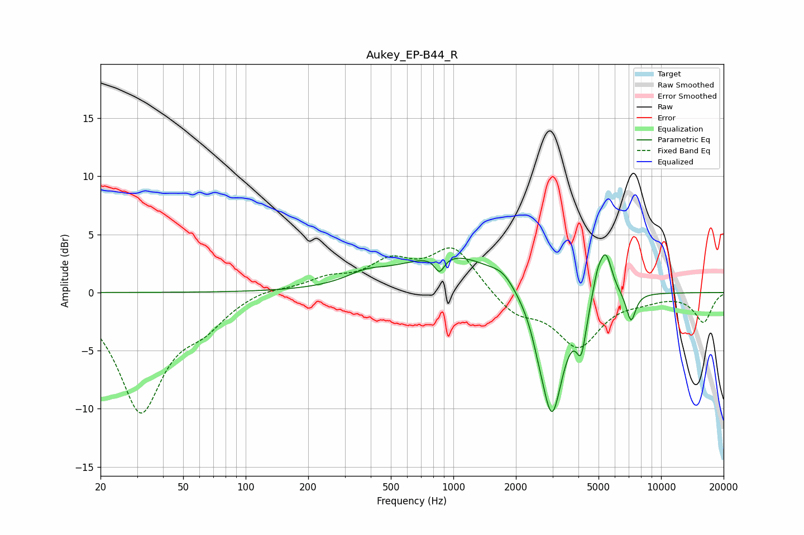

# Aukey_EP-B44_R
See [usage instructions](https://github.com/jaakkopasanen/AutoEq#usage) for more options and info.

### Parametric EQs
Apply preamp of -3.3 dB when using parametric equalizer.

|   # | Type    |   Fc (Hz) |    Q |   Gain (dB) |
|-----|---------|-----------|------|-------------|
|   1 | Peaking |       379 | 1.53 |         0.8 |
|   2 | Peaking |       858 | 6    |        -1.4 |
|   3 | Peaking |       986 | 0.58 |         3.4 |
|   4 | Peaking |      1735 | 2.63 |         0.8 |
|   5 | Peaking |      2581 | 4.91 |        -0.8 |
|   6 | Peaking |      2980 | 2.48 |       -11   |
|   7 | Peaking |      4128 | 6    |        -3.6 |
|   8 | Peaking |      4931 | 6    |         1.5 |
|   9 | Peaking |      5409 | 4.29 |         3.8 |
|  10 | Peaking |      7164 | 5.98 |        -2.5 |

### Fixed Band EQs
When using fixed band (also called graphic) equalizer, apply preamp of **-3.9 dB** (if available) and set gains manually with these parameters.

|   # | Type    |   Fc (Hz) |    Q |   Gain (dB) |
|-----|---------|-----------|------|-------------|
|   1 | Peaking |        31 | 1.41 |       -10   |
|   2 | Peaking |        62 | 1.41 |        -2.1 |
|   3 | Peaking |       125 | 1.41 |         0.5 |
|   4 | Peaking |       250 | 1.41 |         1.1 |
|   5 | Peaking |       500 | 1.41 |         2.3 |
|   6 | Peaking |      1000 | 1.41 |         3.8 |
|   7 | Peaking |      2000 | 1.41 |        -1.8 |
|   8 | Peaking |      4000 | 1.41 |        -4.5 |
|   9 | Peaking |      8000 | 1.41 |        -0.5 |
|  10 | Peaking |     16000 | 1.41 |        -2.5 |

### Graphs

