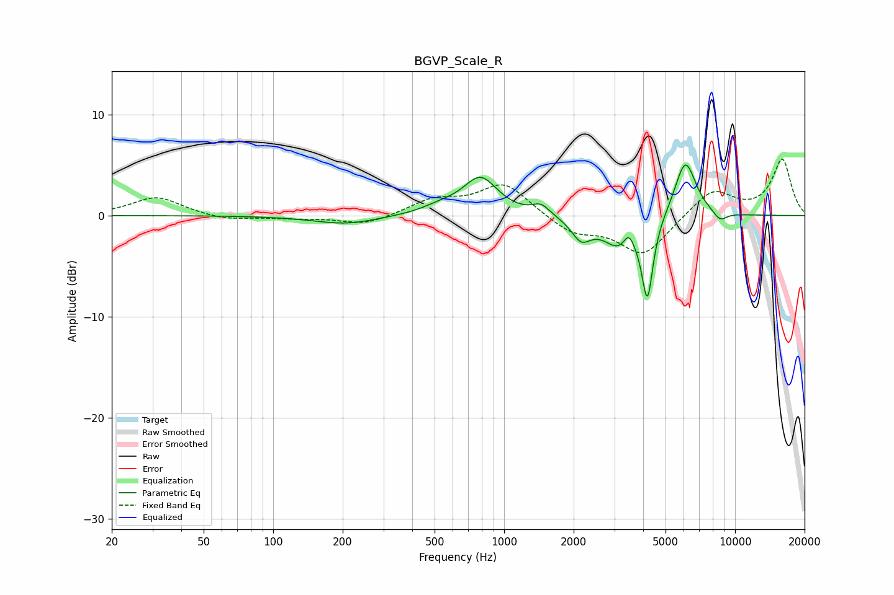

# BGVP_Scale_R
See [usage instructions](https://github.com/jaakkopasanen/AutoEq#usage) for more options and info.

### Parametric EQs
Apply preamp of -5.1 dB when using parametric equalizer.

|   # | Type    |   Fc (Hz) |    Q |   Gain (dB) |
|-----|---------|-----------|------|-------------|
|   1 | Peaking |       206 | 1.02 |        -0.9 |
|   2 | Peaking |       535 | 1.66 |         0.7 |
|   3 | Peaking |       791 | 1.92 |         3.6 |
|   4 | Peaking |      1444 | 3.72 |         1   |
|   5 | Peaking |      2156 | 3.36 |        -2   |
|   6 | Peaking |      3208 | 1.92 |        -3.2 |
|   7 | Peaking |      3461 | 6    |         1.7 |
|   8 | Peaking |      4173 | 5.88 |        -7.6 |
|   9 | Peaking |      6088 | 2.94 |         5.7 |
|  10 | Peaking |      8608 | 4.37 |        -0.9 |

### Fixed Band EQs
When using fixed band (also called graphic) equalizer, apply preamp of **-5.7 dB** (if available) and set gains manually with these parameters.

|   # | Type    |   Fc (Hz) |    Q |   Gain (dB) |
|-----|---------|-----------|------|-------------|
|   1 | Peaking |        31 | 1.41 |         1.9 |
|   2 | Peaking |        62 | 1.41 |        -0.5 |
|   3 | Peaking |       125 | 1.41 |        -0.2 |
|   4 | Peaking |       250 | 1.41 |        -1   |
|   5 | Peaking |       500 | 1.41 |         1.5 |
|   6 | Peaking |      1000 | 1.41 |         3.2 |
|   7 | Peaking |      2000 | 1.41 |        -1.7 |
|   8 | Peaking |      4000 | 1.41 |        -3.9 |
|   9 | Peaking |      8000 | 1.41 |         2.6 |
|  10 | Peaking |     16000 | 1.41 |         5.5 |

### Graphs

