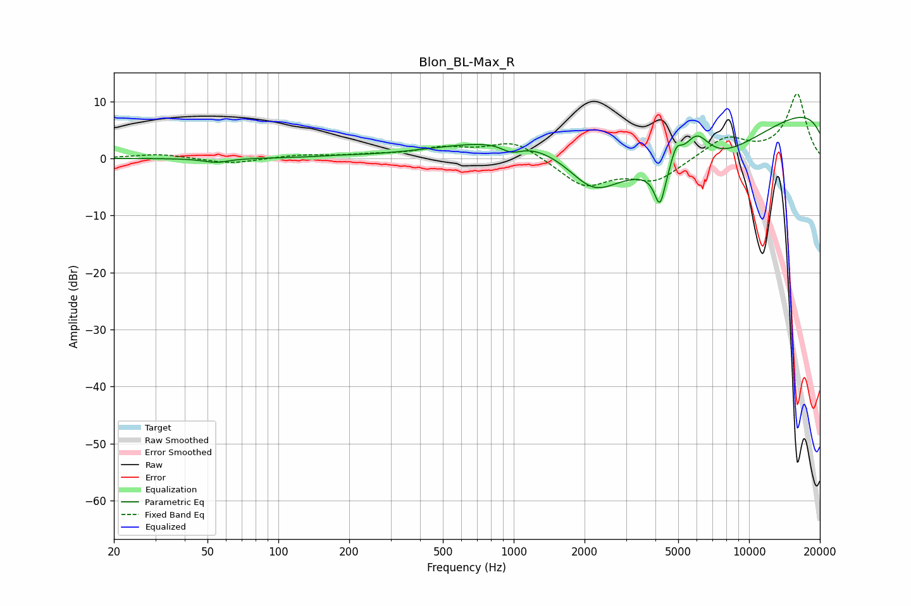

# Blon_BL-Max_R
See [usage instructions](https://github.com/jaakkopasanen/AutoEq#usage) for more options and info.

### Parametric EQs
Apply preamp of -7.3 dB when using parametric equalizer.

|   # | Type    |   Fc (Hz) |    Q |   Gain (dB) |
|-----|---------|-----------|------|-------------|
|   1 | Peaking |        54 | 2.64 |        -0.7 |
|   2 | Peaking |       182 | 1.83 |         0.1 |
|   3 | Peaking |       978 | 3.18 |        -1.5 |
|   4 | Peaking |      1242 | 0.44 |         5   |
|   5 | Peaking |      2174 | 1.21 |        -7   |
|   6 | Peaking |      4180 | 6    |        -6.4 |
|   7 | Peaking |      4901 | 5.91 |         3.3 |
|   8 | Peaking |      5659 | 0.35 |       -16   |
|   9 | Peaking |      5960 | 2.23 |         6.6 |
|  10 | Peaking |     10000 | 0.18 |        14   |

### Fixed Band EQs
When using fixed band (also called graphic) equalizer, apply preamp of **-11.4 dB** (if available) and set gains manually with these parameters.

|   # | Type    |   Fc (Hz) |    Q |   Gain (dB) |
|-----|---------|-----------|------|-------------|
|   1 | Peaking |        31 | 1.41 |         0.8 |
|   2 | Peaking |        62 | 1.41 |        -1   |
|   3 | Peaking |       125 | 1.41 |         0.6 |
|   4 | Peaking |       250 | 1.41 |         0.5 |
|   5 | Peaking |       500 | 1.41 |         1.6 |
|   6 | Peaking |      1000 | 1.41 |         3.1 |
|   7 | Peaking |      2000 | 1.41 |        -4.8 |
|   8 | Peaking |      4000 | 1.41 |        -3.8 |
|   9 | Peaking |      8000 | 1.41 |         3.6 |
|  10 | Peaking |     16000 | 1.41 |        11.3 |

### Graphs

