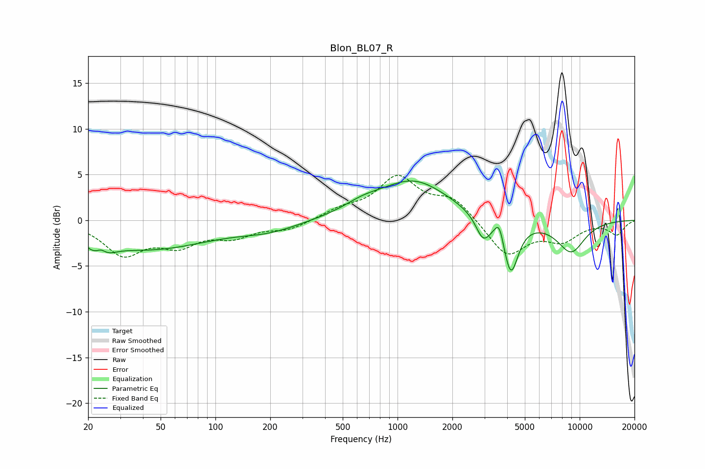

# Blon_BL07_R
See [usage instructions](https://github.com/jaakkopasanen/AutoEq#usage) for more options and info.

### Parametric EQs
Apply preamp of -4.4 dB when using parametric equalizer.

|   # | Type    |   Fc (Hz) |    Q |   Gain (dB) |
|-----|---------|-----------|------|-------------|
|   1 | Peaking |        23 | 2.89 |        -3.2 |
|   2 | Peaking |        23 | 4.25 |         2.3 |
|   3 | Peaking |        43 | 0.42 |        -3.1 |
|   4 | Peaking |       198 | 0.85 |        -0.9 |
|   5 | Peaking |       640 | 1.35 |         0.9 |
|   6 | Peaking |      1225 | 0.73 |         4.3 |
|   7 | Peaking |      2950 | 3.51 |        -2.6 |
|   8 | Peaking |      3617 | 6    |         2   |
|   9 | Peaking |      4184 | 3.4  |        -5.9 |
|  10 | Peaking |      8963 | 1.63 |        -3.4 |

### Fixed Band EQs
When using fixed band (also called graphic) equalizer, apply preamp of **-5.0 dB** (if available) and set gains manually with these parameters.

|   # | Type    |   Fc (Hz) |    Q |   Gain (dB) |
|-----|---------|-----------|------|-------------|
|   1 | Peaking |        31 | 1.41 |        -3.5 |
|   2 | Peaking |        62 | 1.41 |        -2.3 |
|   3 | Peaking |       125 | 1.41 |        -1.5 |
|   4 | Peaking |       250 | 1.41 |        -1   |
|   5 | Peaking |       500 | 1.41 |         1   |
|   6 | Peaking |      1000 | 1.41 |         4.5 |
|   7 | Peaking |      2000 | 1.41 |         2.3 |
|   8 | Peaking |      4000 | 1.41 |        -3.9 |
|   9 | Peaking |      8000 | 1.41 |        -2   |
|  10 | Peaking |     16000 | 1.41 |        -1.5 |

### Graphs

