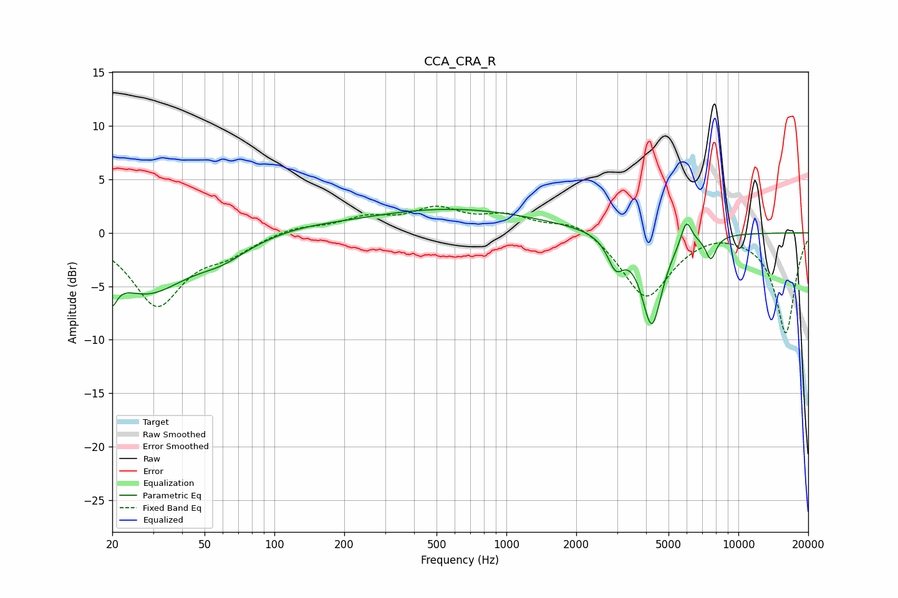

# CCA_CRA_R
See [usage instructions](https://github.com/jaakkopasanen/AutoEq#usage) for more options and info.

### Parametric EQs
Apply preamp of -2.3 dB when using parametric equalizer.

|   # | Type    |   Fc (Hz) |    Q |   Gain (dB) |
|-----|---------|-----------|------|-------------|
|   1 | Peaking |        20 | 5.92 |        -6   |
|   2 | Peaking |        20 | 5.94 |         3.2 |
|   3 | Peaking |        28 | 0.83 |        -5.3 |
|   4 | Peaking |        59 | 1.26 |        -1.4 |
|   5 | Peaking |       130 | 0.92 |         0.4 |
|   6 | Peaking |       575 | 0.37 |         2.2 |
|   7 | Peaking |      2960 | 3.98 |        -2.7 |
|   8 | Peaking |      4236 | 3.11 |        -8.6 |
|   9 | Peaking |      5965 | 6    |         2.3 |
|  10 | Peaking |      7611 | 5.83 |        -2.2 |

### Fixed Band EQs
When using fixed band (also called graphic) equalizer, apply preamp of **-2.6 dB** (if available) and set gains manually with these parameters.

|   # | Type    |   Fc (Hz) |    Q |   Gain (dB) |
|-----|---------|-----------|------|-------------|
|   1 | Peaking |        31 | 1.41 |        -6.7 |
|   2 | Peaking |        62 | 1.41 |        -1.5 |
|   3 | Peaking |       125 | 1.41 |         0.6 |
|   4 | Peaking |       250 | 1.41 |         1.3 |
|   5 | Peaking |       500 | 1.41 |         2   |
|   6 | Peaking |      1000 | 1.41 |         1.4 |
|   7 | Peaking |      2000 | 1.41 |         1.3 |
|   8 | Peaking |      4000 | 1.41 |        -6.1 |
|   9 | Peaking |      8000 | 1.41 |         0.4 |
|  10 | Peaking |     16000 | 1.41 |        -9.4 |

### Graphs

