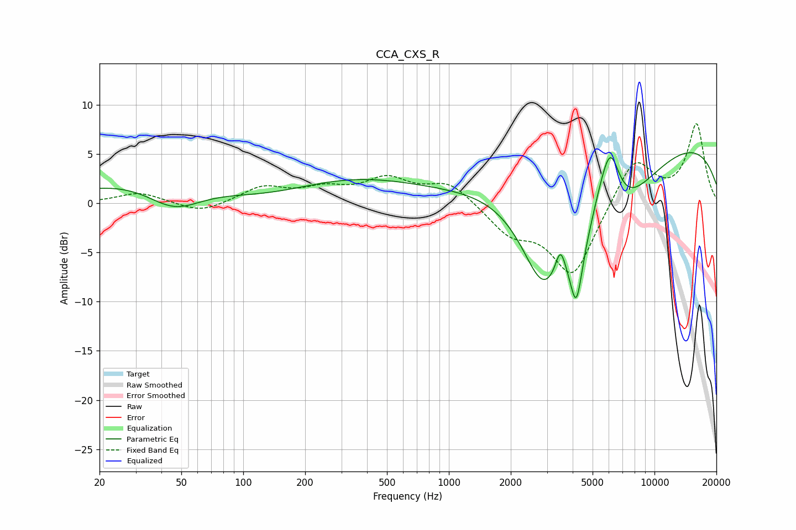

# CCA_CXS_R
See [usage instructions](https://github.com/jaakkopasanen/AutoEq#usage) for more options and info.

### Parametric EQs
Apply preamp of -5.3 dB when using parametric equalizer.

|   # | Type    |   Fc (Hz) |    Q |   Gain (dB) |
|-----|---------|-----------|------|-------------|
|   1 | Peaking |        46 | 1.02 |        -3   |
|   2 | Peaking |       108 | 0.18 |         5   |
|   3 | Peaking |       121 | 0.46 |        -3.5 |
|   4 | Peaking |      2881 | 1.25 |        -9.2 |
|   5 | Peaking |      3486 | 5.94 |         2.6 |
|   6 | Peaking |      4168 | 4.73 |        -6.1 |
|   7 | Peaking |      5418 | 2.37 |         3   |
|   8 | Peaking |      5596 | 0.69 |       -10.2 |
|   9 | Peaking |      6097 | 2.68 |         7.1 |
|  10 | Peaking |      8719 | 0.18 |         7.6 |

### Fixed Band EQs
When using fixed band (also called graphic) equalizer, apply preamp of **-8.2 dB** (if available) and set gains manually with these parameters.

|   # | Type    |   Fc (Hz) |    Q |   Gain (dB) |
|-----|---------|-----------|------|-------------|
|   1 | Peaking |        31 | 1.41 |         1.1 |
|   2 | Peaking |        62 | 1.41 |        -1   |
|   3 | Peaking |       125 | 1.41 |         1.6 |
|   4 | Peaking |       250 | 1.41 |         1.3 |
|   5 | Peaking |       500 | 1.41 |         2.3 |
|   6 | Peaking |      1000 | 1.41 |         2.1 |
|   7 | Peaking |      2000 | 1.41 |        -2.8 |
|   8 | Peaking |      4000 | 1.41 |        -7.4 |
|   9 | Peaking |      8000 | 1.41 |         4.8 |
|  10 | Peaking |     16000 | 1.41 |         8   |

### Graphs

