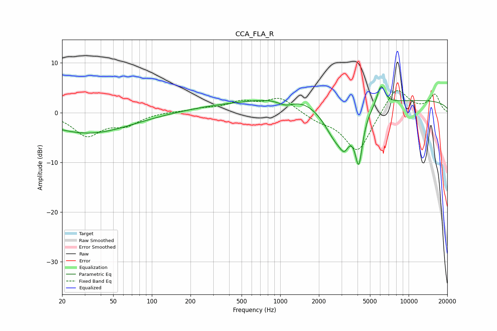

# CCA_FLA_R
See [usage instructions](https://github.com/jaakkopasanen/AutoEq#usage) for more options and info.

### Parametric EQs
Apply preamp of -5.3 dB when using parametric equalizer.

|   # | Type    |   Fc (Hz) |    Q |   Gain (dB) |
|-----|---------|-----------|------|-------------|
|   1 | Peaking |        32 | 0.45 |        -3   |
|   2 | Peaking |        62 | 0.29 |        -2   |
|   3 | Peaking |       260 | 0.19 |         2   |
|   4 | Peaking |      1105 | 2.08 |        -1.6 |
|   5 | Peaking |      1342 | 0.64 |         2.4 |
|   6 | Peaking |      2743 | 1.41 |        -7.5 |
|   7 | Peaking |      3161 | 4.02 |        -3.1 |
|   8 | Peaking |      4089 | 4.7  |        -9.9 |
|   9 | Peaking |      6086 | 4.46 |         4.2 |
|  10 | Peaking |     10000 | 0.18 |         2.5 |

### Fixed Band EQs
When using fixed band (also called graphic) equalizer, apply preamp of **-4.5 dB** (if available) and set gains manually with these parameters.

|   # | Type    |   Fc (Hz) |    Q |   Gain (dB) |
|-----|---------|-----------|------|-------------|
|   1 | Peaking |        31 | 1.41 |        -4.5 |
|   2 | Peaking |        62 | 1.41 |        -2.2 |
|   3 | Peaking |       125 | 1.41 |         0.1 |
|   4 | Peaking |       250 | 1.41 |         0.7 |
|   5 | Peaking |       500 | 1.41 |         2   |
|   6 | Peaking |      1000 | 1.41 |         2.9 |
|   7 | Peaking |      2000 | 1.41 |        -1.3 |
|   8 | Peaking |      4000 | 1.41 |        -8.1 |
|   9 | Peaking |      8000 | 1.41 |         5.5 |
|  10 | Peaking |     16000 | 1.41 |         3.5 |

### Graphs

